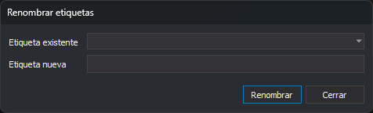

# Renombrar etiquetas
<!-- id: renombrar-etiquetas -->

Este cuadro de diálogo aparece con la opción **Códigos/Renombrar etiquetas...**. Cambia el nombre de una [etiqueta](../../pestanas/codigos/propiedades-del-codigo.md#etiquetas) en todos los códigos que la tienen.

## Controles

* **Etiqueta existente**: desplegable con las etiquetas de la tabla de códigos, en orden alfabético.
* **Etiqueta nueva**: nombre nuevo.
* **Renombrar**: sustituye la etiqueta existente por la nueva en todos los códigos. No hace nada si falta alguno de los dos campos o si los dos nombres solo se diferencian en mayúsculas y minúsculas. El desplegable se vuelve a cargar y el cuadro sigue abierto.
* **Cerrar**: cierra el cuadro. Si se ha renombrado alguna etiqueta, la pestaña **Códigos** se actualiza.
