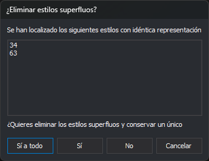

# Comprobaciones
<!-- id: comprobaciones-editor-tablas -->

El submenú **Herramientas/Comprobaciones** busca problemas en la tabla de códigos. El editor también ejecuta todas las comprobaciones al abrir una tabla de códigos.

| Opción | Comprueba |
| :--- | :--- |
| **Todos** | Ejecuta todas las comprobaciones siguientes, en orden. |
| **Estilos/Símbolos invisibles** | Estilos con símbolo cuyo factor de escala en X o en Y es 0. Ofrece corregirlos: en esos estilos, los factores de escala y la distancia que valen 0 pasan a 1. |
| **Estilos/Símbolos inexistentes** | Códigos puntuales cuyas representaciones no tienen ningún estilo con símbolo, y que por tanto no se ven. Solo los lista. |
| **Estilos/Estilos idénticos** | Estilos con la misma representación. Ver [¿Eliminar estilos superfluos?](#eliminar-estilos-superfluos). |
| **Estilos/Estilos no utilizados** | Estilos que no usa ningún código. Ofrece eliminarlos. |
| **Códigos/Códigos con estilos inexistentes** | Códigos con representaciones que usan un estilo que no existe. Ofrece sustituirlo por un estilo que se elige en el cuadro [Selecciona el estilo](../../pestanas/selecciona-el-estilo.md). |
| **Base de datos/Tablas inexistentes** | Tablas que algún código usa en su propiedad **Tabla** y que no existen en la pestaña Base de datos. Solo las lista. |
| **Base de datos/Tablas sin clave primaria** | Tablas sin campo de clave principal. Solo las lista. |
| **Base de datos/Tablas con múltiples claves primarias** | Tablas con más de un campo de clave principal. Solo las lista. |
| **Base de datos/Tablas cuya clave primaria no sea de tipo "número"** | Tablas con una clave principal que no es numérica. Solo las lista. |

Cada comprobación muestra un mensaje solo si encuentra algún problema.

Antes de **Símbolos invisibles**, **Estilos idénticos** y **Estilos no utilizados**, el editor aplica o descarta, preguntando, los cambios pendientes de las pestañas **Estilos** y **Códigos**. Si eliminan algún estilo, las dos pestañas se vuelven a cargar.

## ¿Eliminar estilos superfluos?

**Estilos idénticos** muestra este cuadro de diálogo por cada grupo de estilos con la misma representación. La lista **Se han localizado los siguientes estilos con idéntica representación** muestra el grupo: el primer estilo es el que se conserva y los siguientes son los superfluos.

* **Sí a todo**: elimina los superfluos de este grupo y de los siguientes sin volver a preguntar.
* **Sí**: elimina los superfluos de este grupo.
* **No**: conserva este grupo y pasa al siguiente.
* **Cancelar**: detiene la comprobación. Lo eliminado hasta ese momento no se recupera.

Al eliminar un estilo superfluo, las representaciones de los códigos que lo usaban pasan a usar el estilo que se conserva.
