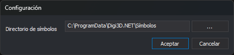

# Configuración
<!-- id: configuracion-editor-tablas -->

La opción **Herramientas/Configuración...** abre este cuadro de diálogo. El editor también lo abre al crear una tabla nueva si no hay ninguna carpeta de símbolos configurada.

## Controles

* **Directorio de símbolos**: carpeta con los símbolos (`.bin`) que usan los estilos. El editor la usa para dibujar los estilos en las pestañas **Estilos** y **Códigos**, y en el cuadro **Selecciona el símbolo**. El botón **...** abre el selector de carpetas.
* **Aceptar**: guarda la carpeta en el registro de Windows del usuario.
* **Cancelar**: cierra el cuadro sin cambiar la carpeta.
