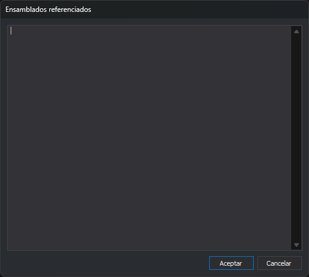

# Referencias
<!-- id: referencias -->

La opción **Herramientas/Referencias...** abre el cuadro **Ensamblados referenciados**, con una lista de ensamblados .NET, uno por línea. La lista se guarda en la tabla de códigos, en el elemento `referenceAssemblies`.

La lista servía para compilar los guiones de control de calidad escritos en C#, Visual Basic .NET o JScript .NET. Digi3D.AI ya no usa esos guiones: los controles de calidad se escriben en Python en la pestaña [Entorno Python](../../pestanas/entorno-python.md), y ninguna parte del programa lee esta lista.

**Aceptar** guarda la lista en la tabla de códigos; las líneas vacías se descartan. **Cancelar** cierra el cuadro sin cambiarla.
