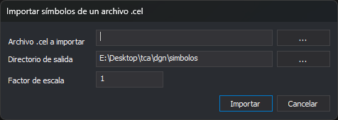

# Importar símbolos de un archivo .cel
<!-- id: importar-simbolos-cel -->

Esta opción del menú **Símbolos** convierte las células de una biblioteca de células de MicroStation (`.cel`) en símbolos de Digi3D.AI: un archivo de dibujo `.bin` por célula.

## Controles

* **Archivo .cel a importar**: biblioteca de células. El botón **...** abre el cuadro **Abrir** con el filtro **Archivos de células de MicroStation**.
* **Directorio de salida**: carpeta donde se escriben los símbolos. Propone la carpeta de símbolos de [Configuración](../herramientas/configuracion.md). El botón **...** abre el selector de carpetas.
* **Factor de escala**: factor que se aplica a las coordenadas de las células. Por defecto, 1.
* **Importar**: ejecuta la importación.
* **Cancelar**: cierra el cuadro sin importar.

La conversión la hace la extensión de importación de archivos DGN. Si ninguna extensión cargada la ofrece, el editor muestra el mensaje **No se ha encontrado ninguna extensión capaz de importar símbolos de un archivo CEL de MicroStation.**

Para que los estilos usen los símbolos importados, la carpeta de salida tiene que ser la carpeta de símbolos de la configuración.
