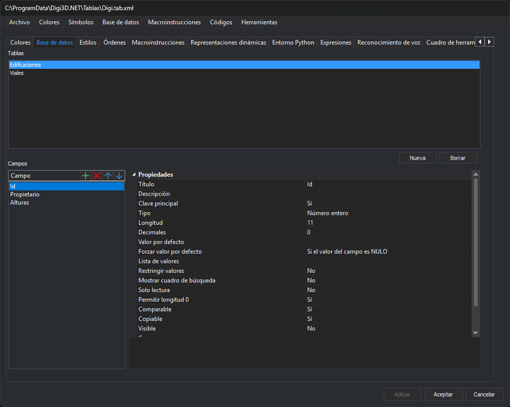

# Base de datos
<!-- id: base-de-datos-3 -->

Esta pestaña configura las tablas de la base de datos y los campos de cada tabla. Cada código puede enlazar con una tabla mediante su propiedad [Tabla](../codigos/base-de-datos.md#tabla).

## Tablas

Lista de las tablas definidas en la tabla de códigos.

* **Nueva**: pide el nombre de la tabla y la crea con un campo `Id` de clave principal. La tabla nueva se añade a la tabla de códigos al aplicar los cambios.
* **Borrar**: elimina la tabla seleccionada. Si algún código enlaza con ella, un cuadro de tareas ofrece tres opciones:
  * **Quitar el enlace a esta tabla a dichos códigos**: deja vacía la propiedad **Tabla** de esos códigos y elimina la tabla.
  * **Mantener la tabla pero vacía**: elimina todos los campos salvo un campo `Id` nuevo y mantiene los enlaces de los códigos.
  * **Cancelar**: no hace nada.

## Campos

Lista de los campos de la tabla seleccionada. Su barra de herramientas tiene cuatro botones:

* **Nuevo** (+): añade un campo. Escribe su nombre en la lista.
* **Eliminar** (x): elimina el campo seleccionado.
* **Subir** y **Bajar** (flechas): cambian la posición del campo seleccionado en la tabla.

Al seleccionar un campo, sus [propiedades](propiedades-de-los-campos.md) aparecen a la derecha.

## Aplicar los cambios

Los cambios de la tabla seleccionada se aplican al pulsar **Aplicar** o **Aceptar**. Si seleccionas otra tabla o cambias de pestaña con cambios sin aplicar, el editor pregunta si aplicarlos.

El menú [Base de datos](../../menus/base-de-datos/README.md) tiene opciones que actúan sobre todas las tablas a la vez.
