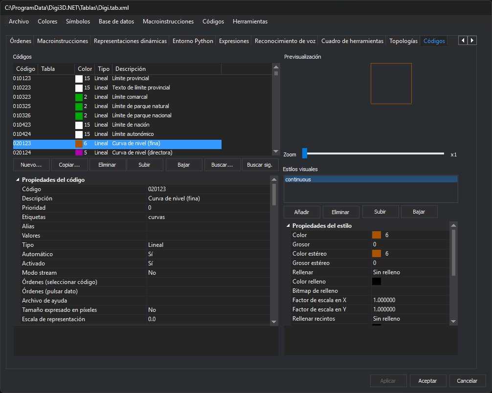

# Códigos
<!-- id: codigos -->

Esta pestaña configura los códigos de la tabla de códigos y sus representaciones.

## Lista de códigos

La lista **Códigos** muestra una fila por código, con las columnas **Código**, **Tabla**, **Color** (el número del color de la primera representación, con una muestra), **Tipo** y **Descripción**. El menú contextual de la lista permite **Mover arriba**, **Mover abajo**, **Mover al principio** y **Mover al final** el código seleccionado.

Botones de la lista:

* **Nuevo...**: abre el cuadro **Nuevo código**, que pide el nombre del código y avisa si ya existe en la tabla de códigos.
* **Copiar...**: crea un código nuevo con las propiedades del seleccionado; pide su nombre en el mismo cuadro.
* **Eliminar**: elimina el código seleccionado.
* **Subir** y **Bajar**: cambian la posición del código seleccionado.
* **Buscar...**: abre el cuadro **Buscar**, que localiza un código por su nombre. Sus casillas **Permitir buscar por descripción**, **Coincidir mayúsculas/minúsculas** y **Solo palabras completas** ajustan la búsqueda.
* **Buscar sig.**: busca la siguiente coincidencia con los mismos criterios.

## Propiedades del código

La cuadrícula inferior izquierda muestra las propiedades del código seleccionado, en tres categorías:

* [Propiedades del código](propiedades-del-codigo.md).
* [Base de datos](base-de-datos.md).
* **Control de calidad**: la casilla **Analizar control de calidad al digitalizar** y **Controles de calidad a aplicar**, que abre el cuadro **Controles de calidad**.

## Previsualización y estilos visuales

**Previsualización** dibuja el código seleccionado con sus representaciones. La barra **Zoom** cambia la escala del dibujo.

La lista **Estilos visuales** muestra las representaciones del código. Una geometría con este código se dibuja con todas ellas, en el orden de la lista.

* **Añadir**: abre el cuadro **Selecciona el estilo** y añade una representación con el estilo elegido.
* **Eliminar**: elimina la representación seleccionada.
* **Subir** y **Bajar**: cambian el orden de la representación seleccionada.

Al seleccionar una representación, la cuadrícula **Propiedades del estilo** muestra su color, grosor, color y grosor en estéreo, relleno y el resto de sus propiedades.

## Aplicar los cambios

Los cambios del código seleccionado se aplican al pulsar **Aplicar** o **Aceptar**. Si seleccionas otro código o cambias de pestaña con cambios sin aplicar, el editor pregunta si aplicarlos.

El menú [Códigos](../../menus/codigos/README.md) tiene opciones que importan códigos de otros formatos y actúan sobre varios códigos a la vez.
