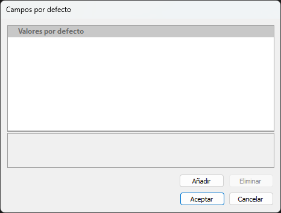
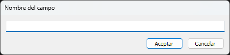

# Base de datos
<!-- id: base-de-datos-4 -->

Esta categoría permite configurar la relación de este código con base de datos.

## Tabla

Este desplegable permite configurar la tabla a mostrar en las ventanas que muestran atributos de base de datos, como el panel [Campos de la base de datos](/digi3d-ai/referencia/paneles/campos-de-la-base-de-datos.md) al seleccionar este código.

Muestra un desplegable que permite seleccionar alguna de las tablas añadidas en la pestaña [Base de datos](/digi3d-ai/referencia/editor-de-tablas-de-codigos/pestanas/base-de-datos/README.md).

## Valores por defecto

Valores que se asignan a los campos de la base de datos de las geometrías que se digitalizan con este código. La propiedad muestra el primer par `campo=valor`, seguido de `...` si hay más de uno.

El botón **...** abre el cuadro de diálogo **Campos por defecto**:



* **Valores por defecto**: un campo por fila, con su valor. Escribe el valor en la columna derecha.
* **Añadir**: abre el cuadro de diálogo **Nombre del campo**, que pide el nombre del campo y añade una fila con el valor vacío. No comprueba si el campo existe en la tabla ni si ya está en la lista.
* **Eliminar**: elimina el campo seleccionado. Se habilita al seleccionar un campo.
* **Aceptar** guarda la lista; **Cancelar** la deja como estaba.



## Condiciones

Especifica las condiciones que debe tener un registro en la base de datos para considerar que éste es el código.

Este campo opcional tiene significado únicamente en archivos SIG como por ejemplo Shapefiles.

Supongamos que tenemos un Shapefile con una tabla _Edificaciones_. Supongamos que uno de los campos de base de datos de la tabla Edificaciones es _Tipo_, que puede tener uno de los siguientes valores:

| Valor | Significado |
| :--- | :--- |
| 0 | Edificio en construcción |
| 1 | Edificio privado |
| 2 | Edificio público |

Ahora supongamos que en la tabla de códigos tenemos tres códigos:

| Código | Descripción |
| :--- | :--- |
| 010101 | Edificio en construcción |
| 010102 | Edificio privado |
| 010103 | Edificio público |
| 010104 | Resto de edificaciones |

En la tabla de códigos tendríamos que seleccionar en el campo [Tabla](base-de-datos.md#tabla) de cada uno de los tres códigos la tabla _Edificaciones,_ pero eso haría que el importador de Shapefiles no supiera qué código asignar a cada una de las geometrías almacenadas en la tabla _Edificaciones_, porque hay tres códigos posibles: 010101, 010102, 010103 y 010104.

El campo **Condiciones** soluciona este problema.

Para el código 010101 introduciríamos el siguiente valor en **Condiciones**:

```text
Tipo=0
```

Para el código 010102:

```text
Tipo=1
```

Para el código 010103:

```text
Tipo=2
```

Y por último para el código 010104 dejaríamos en blanco el campo **Condiciones**.

De esta manera, el importador de Shapefiles si se encuentra una geometría que tenga asignado en el campo Tipo el valor 1, asignará a la geometría el código 010102.

