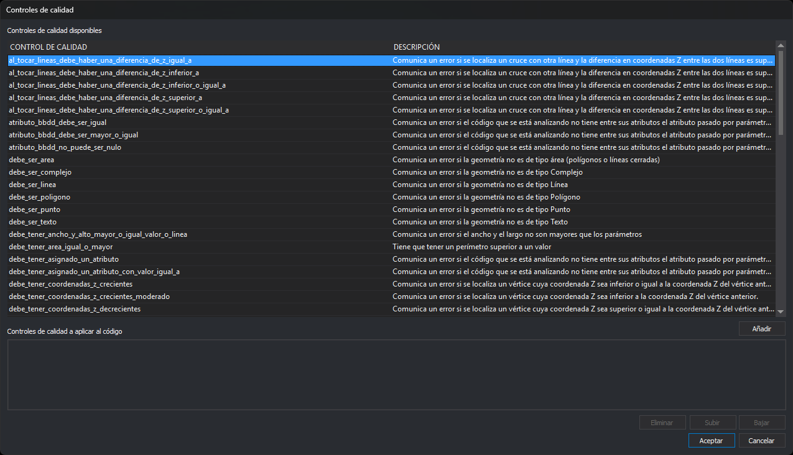
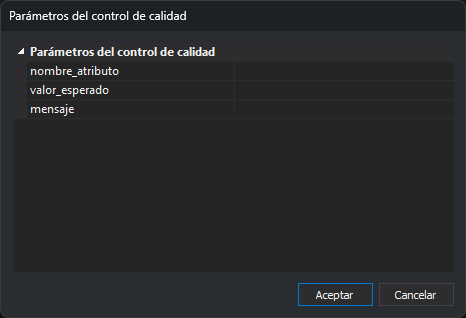

# Propiedades del código
<!-- id: propiedades-del-codigo -->

Esta categoría permite configurar las propiedades de un código.

## Código

Permite configurar el nombre del código.

El nombre del código identifica al código y no puede haber más de un código en una tabla de códigos con el mismo nombre. Este nombre es el que podremos pasar como parámetros en órdenes como [COD+](/digi3d-ai/referencia/ventana-de-dibujo/ordenes/c/cod-mas.md).

## Descripción

Permite introducir una descripción del código como por ejemplo _Curva de nivel directora._

## Prioridad

Algunas órdenes de Digi3D.AI como [BINTRAM](/digi3d-ai/referencia/ventana-de-dibujo/ordenes/b/bintram.md) permiten agrupar geometrías duplicadas en una única geometría con múltiples códigos. Si los códigos tienen asignado en este campo un valor, el programa ordenará los códigos en la geometría generada con múltiples códigos utilizando como criterio este valor de prioridad.

## Etiquetas

Permite configurar etiquetas asociadas al código.

Las etiquetas son una forma de agrupar códigos que sustituyen los antiguos archivos de _tablas de códigos_ (que eran un archivo de texto que tenía tantas líneas como códigos).

Un código puede tener:

* Ninguna etiqueta asociada.
* Una o varias etiquetas.

En caso de que un código tenga más de una etiqueta, las separaremos con una coma.

Ejemplo: si queremos asignar a un determinado código las etiquetas _planimetría_, _viales_ y _carreteras_, introduciremos en este campo el siguiente valor:

```
planimetría, viales, carreteras
```

Ciertas órdenes permiten trabajar con etiquetas. Podemos indicar a estas órdenes que les estamos pasando una etiqueta si ponemos el carácter almohadilla (#) delante de la etiqueta.

Ejemplo: La orden [OFF](/digi3d-ai/referencia/ventana-de-dibujo/ordenes/o/off.md) oculta la visualización de las geometrías que tengan el código pasado por parámetro. Esta orden admite que le pasemos en vez de un código, una etiqueta, de manera que, si queremos dejar de visualizar todas las geometrías que tengan la etiqueta "_viales"_, ejecutaremos la siguiente orden:

```
off=#viales
```

### Menús dinámicos

Digi3D.AI muestra en determinados menús (como por ejemplo el menú **Ver**), las etiquetas de la tabla de códigos activa, de manera que podremos ejecutar comandos que tomarán como datos de entrada todas las geometrías que tengan algún código que tenga asociada la etiqueta seleccionada.

En el caso del menú **Ver**, si la tabla de códigos activa tiene códigos con la etiqueta _Vegetación_, mostrará una opción con la palabra _Vegetación**.**_ Si el usuario selecciona esta opción, el programa activará la visualización de todas las geometrías cuyos códigos tengan esta etiqueta.

## Alias

Permite indicar opcionalmente uno o varios alias para este código.

Esto es útil si el operador está acostumbrado a trabajar con una nomenclatura, para que la curva de aprendizaje sea menor y no tenga que aprender los nuevos códigos.

Ejemplo: Podemos añadir el alias "fina" al código "020123", de esta manera si el operador ejecuta desde la orden de comandos la siguiente orden:

```
cod=fina
```

La orden [COD+](/digi3d-ai/referencia/ventana-de-dibujo/ordenes/c/cod-mas.md) seleccionará automáticamente el código "020123".

## Valores

Permite crear un diccionario de valores asociado con el código.

Este valor es opcional, y en caso de asignar valores, podemos indicar tantos como queramos.

La forma de introducir valores es siguiendo el patrón `propiedad=valor`_._ En caso de asignar más de un valor, los separaremos por comas.

Ejemplo: Para asignar a un determinado código los valores: "ancho" con el valor "13" y "categoría" con el valor "002" introduciremos el siguiente valor en el campo Valores:

```
ancho=13, categoría=002
```

Estos valores se pueden utilizar al aplicar la [macro de base de datos](../base-de-datos/macros-de-base-de-datos.md) `%CENTROID_VALUE=[valor]%`

## Tipo

Indica el tipo de geometría que representa el código.

Se puede seleccionar una de las siguientes opciones:

* **Lineal** Indica que este código está pensado para almacenar líneas.
* **Puntual** Indica que este código está pensado para almacenar puntos.
* **Virtual** Indica que este código está pensado para dibujar geometrías en la ventana de dibujo pero que estas geometrías no se almacenan en ningún archivo de dibujo.

El valor almacenado aquí no es un contrato vinculante, de manera que, si indicamos en este campo el valor _Puntual_ para un determinado código, y luego en la ventana de dibujo seleccionamos este código en particular y ejecutamos la orden [CIR2P](/digi3d-ai/referencia/ventana-de-dibujo/ordenes/c/cir2p.md), podremos dibujar un círculo con este código que se ha marcado como puntual.

El valor almacenado en este campo se utiliza criterio para [ejecutar órdenes de manera automática](/digi3d-ai/referencia/ordenes/formas-de-ejecutar-una-orden/de-manera-automatica/) si el programa está en [modo preparado](/digi3d-ai/referencia/ordenes/formas-de-ejecutar-una-orden/de-manera-automatica/modo-preparado.md) y el usuario pulsa el botón de Dato en la ventana de dibujo.

## Automático

Indica si al estar este código seleccionado como código activo y al estar el programa en[ modo preparado](/digi3d-ai/referencia/ordenes/formas-de-ejecutar-una-orden/de-manera-automatica/modo-preparado.md), si el usuario pulsa el botón de Dato en la ventana de dibujo, si se desencadenará el proceso que ejecuta una [orden de manera automática](/digi3d-ai/referencia/ordenes/formas-de-ejecutar-una-orden/de-manera-automatica/).

Se pueden seleccionar las siguientes opciones:

* **Si** Indica que este código desencadena que se ejecuten órdenes automáticas.
* **No** Indica que este código no desencadenará que se ejecuten órdenes automáticas.

## Activado

Permite indicar si el usuario podrá seleccionar este código para digitalizar entidades nuevas.

Esta opción es útil para permitir mostrar y reconocer geometrías existentes pero no se quiere que se generen geometrías nuevas con este código.

Se pueden seleccionar las siguientes opciones:

* **Si** Indica que este código se puede seleccionar para digitalizar entidades nuevas.
* **No** Indica que este código no se puede seleccionar para digitalizar entidades nuevas.

## Modo Stream

Indica si este código está pensado para digitalizar líneas en modo continuo.

Determinadas geometrías como por ejemplo las curvas de nivel se digitalizan habitualmente en modo continuo. Eso requiere que el usuario mantenga pulsado el botón/pedal de dato mientras digitaliza la geometría.

Con esta opción se puede indicar a la orden [LINEA](/digi3d-ai/referencia/ventana-de-dibujo/ordenes/l/linea.md) se deben añadir segmentos a la línea.

## Órdenes (seleccionar código)

Permite indicar el conjunto de órdenes que se ejecutarán cuando se seleccione el código.

## Órdenes (pulsar dato)

Permite indicar el conjunto de órdenes que se ejecutarán cuando el usuario pulse el botón de Dato si este código está activo.

### Cuadro de diálogo Órdenes

El botón **...** de las dos propiedades de órdenes abre el cuadro de diálogo **Órdenes**, con un cuadro de texto que contiene una orden por línea. **Aceptar** guarda las líneas; se quitan los espacios del principio y del final de cada una. La propiedad muestra la primera orden, seguida de `...` si hay más de una.

## Archivo de ayuda

Permite especificar el nombre del archivo de ayuda que se mostrará en el panel [Ayuda dinámica](/digi3d-ai/referencia/paneles/ayuda-dinamica.md) si se selecciona este código.

El archivo indicado en este campo debe existir en el [directorio de ayudas de usuario](/digi3d-ai/referencia/cuadros-de-dialogo/configuracion/comunicacion-con-el-usuario/directorio-de-ayudas-de-codigos.md) configurado en el programa.

## Tamaño expresado en píxeles

Si vale **Sí**, los textos y puntos con este código se dibujan con su altura en píxeles: el nivel de zoom no cambia su tamaño en pantalla.

## Escala de representación

Denominador de la escala de visualización más pequeña a la que se dibuja la geometría. Con 5000, la geometría se dibuja a 1:5000 y a escalas mayores, como 1:2000, pero no a escalas menores, como 1:10000. Con 0 se dibuja siempre.

## Control de calidad

Esta categoría tiene dos propiedades:

* **Analizar control de calidad al digitalizar**: si vale **Sí**, al digitalizar una geometría con este código se analizan los controles de calidad en los que interviene el código. Los controles de calidad asignados se analizan siempre al ejecutar las opciones del menú **Control de calidad**, valga lo que valga esta propiedad.
* **Controles de calidad a aplicar**: el botón de la propiedad abre el cuadro **Controles de calidad**, que asigna al código funciones de control de calidad de la pestaña [Entorno Python](../entorno-python.md). Consulta [Controles de calidad en Python](/digi3d-ai/programacion/python/controles-de-calidad/README.md).

### Cuadro de diálogo Controles de calidad



* **Controles de calidad disponibles**: las funciones de control de calidad, con su descripción. **Añadir**, o hacer doble clic en una fila, la añade a la lista inferior.
* **Controles de calidad a aplicar al código**: las funciones asignadas al código, en el orden en que se aplican. **Eliminar** quita la seleccionada; **Subir** y **Bajar** cambian su posición.
* **Aceptar** guarda la lista en la propiedad, una función por línea. El cuadro de diálogo se puede redimensionar y recuerda su tamaño y su posición.

### Cuadro de diálogo Parámetros del control de calidad



Si la función que se añade tiene parámetros, **Añadir** abre este cuadro de diálogo con una fila por parámetro. Al pulsar **Aceptar**, la función se añade con sus valores como diccionario de Python, por ejemplo `atributo_bbdd_debe_ser_igual({"nombre_atributo":"TIPO", "valor_esperado":3, "mensaje":"Tipo incorrecto"})`. Un valor que es un número de Python, formado por cifras y como mucho un punto decimal (`3`, `0.5`, `.5`, `2.`), se escribe sin comillas. El resto, incluidos un valor vacío y un número entero con ceros a la izquierda como `007`, se escribe entre comillas, con las barras invertidas y las comillas dobles escapadas.
