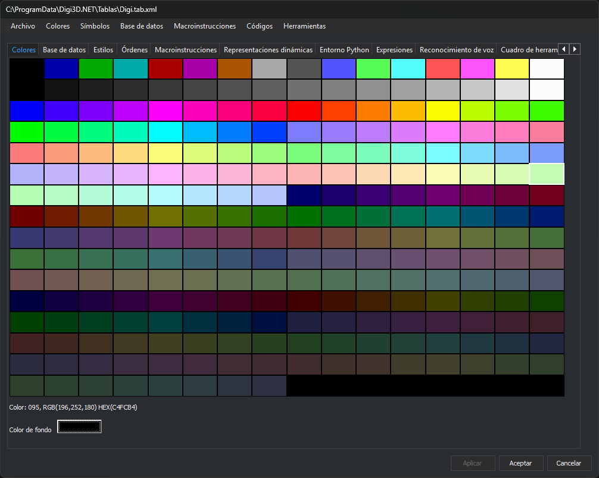

# Colores
<!-- id: colores -->

Esta pestaña configura la paleta de 256 colores de la tabla de códigos y el color de fondo de la ventana de dibujo. Los estilos de los códigos hacen referencia a los colores por su número en la paleta.

## Paleta de colores

La paleta ocupa la parte superior de la pestaña: 16 filas de 16 colores, numerados de 0 a 255 de izquierda a derecha y de arriba abajo.

* Al pasar el cursor sobre un color, la línea inferior muestra su número y su valor, por ejemplo `Color: 095, RGB(196,252,180) HEX(C4FCB4)`.
* Al hacer clic en un color se abre el cuadro de diálogo de selección de color. Si lo aceptas, el color de esa entrada cambia.

## Color de fondo

El botón **Color de fondo** muestra el color de fondo de la ventana de dibujo que se abre con esta tabla de códigos. Al pulsarlo se abre el cuadro de diálogo de selección de color. La variable [COLOR\_FONDO](/digi3d-ai/referencia/ventana-de-dibujo/variables/c/color-fondo.md) cambia este color durante la sesión.

## Menú Colores

| Opción | Acción |
| :--- | :--- |
| **Importar...** | Sustituye la paleta por la de otro archivo: una tabla de códigos (`.tab.xml`), una paleta de Digi21 (`.pal`, un color `R G B` por línea) o una tabla de colores de MicroStation (`.tbl`). En un `.tbl`, el primer color pasa a la entrada 255 y los siguientes a las entradas 0 a 254. El color de fondo pasa a negro. |
| **Restaurar** | Recupera la paleta que tenía la tabla de códigos al abrirla. No cambia el color de fondo. |
| **Estándar de Digi** | Sustituye la paleta por la paleta estándar de Digi3D.AI y pone el fondo en negro. |
| **Estándar de MicroStation** | Sustituye la paleta por la paleta estándar de MicroStation y pone el fondo en negro. |
| **Estándar de MicroStation (256 colores)** | Sustituye la paleta por la paleta de 256 colores de MicroStation y pone el fondo en negro. |

## Aplicar y guardar los cambios

Los cambios de esta pestaña se aplican a la tabla de códigos al pulsar **Aplicar**, al cambiar de pestaña o al pulsar **Aceptar**. Se guardan en el archivo con **Archivo/Guardar**, o al pulsar **Aceptar** y responder que sí a la pregunta de guardar los cambios.
