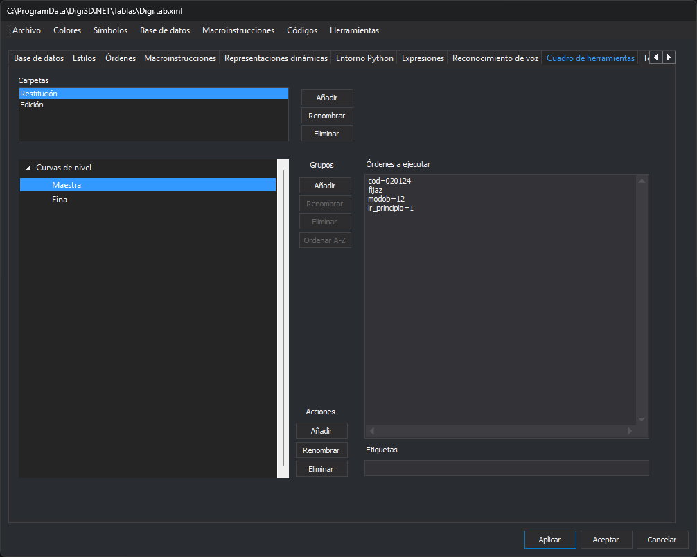

# Cuadro de herramientas
<!-- id: cuadro-de-herramientas-2 -->

Esta pestaña configura el contenido del panel [Cuadro de herramientas](/digi3d-ai/referencia/paneles/cuadro-de-herramientas.md) de Digi3D.AI cuando la ventana de dibujo usa esta tabla de códigos. El contenido se organiza en carpetas; cada carpeta tiene grupos, y cada grupo, acciones. Una acción es un botón del panel que ejecuta una lista de órdenes.

## Carpetas

* **Carpetas**: lista de carpetas de la tabla de códigos.
* **Añadir**: pide el nombre de una carpeta nueva. Si ya existe una carpeta con ese nombre, no la añade.
* **Renombrar**: pide el nombre nuevo de la carpeta seleccionada.
* **Eliminar**: elimina la carpeta seleccionada con sus grupos y acciones.

## Grupos y acciones

El panel de la izquierda muestra los grupos de la carpeta seleccionada y, dentro de cada grupo, sus acciones.

Botones de **Grupos**, que actúan sobre el grupo del elemento seleccionado en el panel:

* **Añadir**: pide el nombre de un grupo nuevo para la carpeta seleccionada. Si la carpeta ya tiene un grupo con ese nombre, no lo añade.
* **Renombrar**: abre el cuadro **Renombrar grupo** con el nombre del grupo.
* **Eliminar**: elimina el grupo con sus acciones.
* **Ordenar A-Z**: ordena alfabéticamente las acciones del grupo.

Botones de **Acciones**:

* **Añadir**: pide el nombre de una acción nueva para el grupo.
* **Renombrar**: pide el nombre nuevo de la acción seleccionada.
* **Eliminar**: elimina la acción seleccionada.

## Órdenes a ejecutar y Etiquetas

Al seleccionar una acción se habilitan dos campos:

* **Órdenes a ejecutar**: órdenes que ejecuta la acción, una por línea.
* **Etiquetas**: etiquetas de la acción.

Los cambios de esta pestaña se escriben en la tabla de códigos al hacerlos. Se guardan en el archivo con **Archivo/Guardar** o al pulsar **Aceptar** y responder que sí a la pregunta de guardar los cambios.
