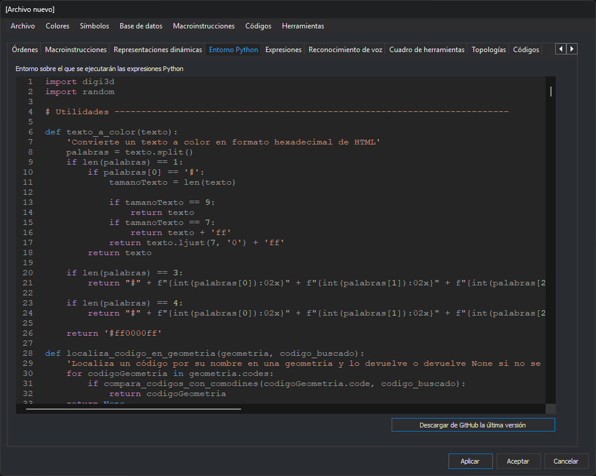

# Entorno Python
<!-- id: entorno-python -->

Esta pestaña contiene el código Python que Digi3D.AI carga con la tabla de códigos: las funciones de los [controles de calidad](../../../programacion/python/controles-de-calidad/README.md) y las funciones auxiliares que usan las expresiones Python de la tabla.

## Campos

* **Entorno sobre el que se ejecutarán las expresiones Python**: editor del código Python, con número de línea y coloreado de sintaxis.
* **Descargar de GitHub la última versión**: sustituye todo el contenido del editor por el archivo `guiones.py` del repositorio [Guiones-Control-Calidad-Python-Digi3D](https://github.com/digi21/Guiones-Control-Calidad-Python-Digi3D), que contiene los controles de calidad de Digi21. Se necesita conexión a Internet.

Los cambios se guardan en la tabla de códigos al pulsar **Aplicar** o **Aceptar**.

Para actualizar una tabla de códigos creada con una versión anterior de Digi3D, consulta [Actualizar los controles de calidad Python de una tabla de códigos](../../../usuarios-de-versiones-anteriores/actualizar-guiones-python.md).
