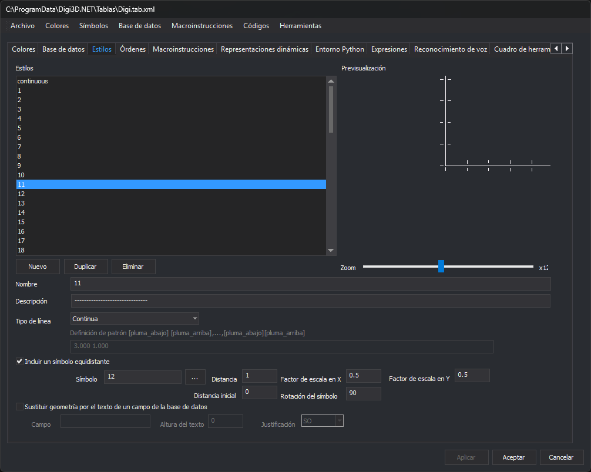

# Estilos
<!-- id: estilos -->



Esta pestaña configura los estilos con los que se dibujan las geometrías. Cada representación de un código hace referencia a un estilo; el color y el grosor los fija la representación, no el estilo.

## Estilos

Lista de los estilos de la tabla de códigos. Al seleccionar uno, sus propiedades aparecen en la parte inferior y su dibujo en **Previsualización**.

* **Nuevo**: crea un estilo.
* **Duplicar**: crea una copia del estilo seleccionado. Se deshabilita mientras el estilo tiene cambios sin aplicar.
* **Eliminar**: elimina el estilo seleccionado. No se puede eliminar el último estilo. Si algún código usa el estilo, un cuadro de tareas lista esos códigos y ofrece sustituirlo por el primer estilo de la lista (por el segundo, si se elimina el primero) o elegir el sustituto en el cuadro **Selecciona el estilo**.

## Previsualización y Zoom

**Previsualización** dibuja el estilo seleccionado. La barra **Zoom** cambia la escala del dibujo; el factor aparece a su derecha.

## Nombre y Descripción

* **Nombre**: nombre del estilo. Dos estilos no pueden tener el mismo nombre, sin distinguir mayúsculas de minúsculas: al aplicar, el editor lo avisa y no aplica los cambios. Al cambiar el nombre, las representaciones de los códigos que usaban el estilo pasan a usar el nombre nuevo.
* **Descripción**: descripción opcional.

## Tipo de línea

Indica cómo se dibuja una línea con este estilo. No se aplica a las geometrías puntuales.

* **Invisible**: no se dibuja la línea base.
* **Continua**: se dibuja una línea continua.
* **Con patrón**: se dibuja la línea según el campo **Definición de patrón**, que solo se habilita con esta opción.

### Definición de patrón

Lista de valores que alternan un tramo dibujado (pluma abajo) y un hueco (pluma arriba), en unidades del dibujo. Por ejemplo, para dibujar `---- - ---- - ----`:

```
4 1 1 1
```

* Dibuja una línea de 4 unidades.
* Deja un espacio de 1 unidad.
* Dibuja una línea de 1 unidad.
* Deja un espacio de 1 unidad.

## Incluir un símbolo equidistante

Si se activa, el estilo dibuja un símbolo a lo largo de la línea, o en la posición del punto si la geometría es puntual. Los siguientes campos se habilitan con esta casilla:

* **Símbolo**: nombre del símbolo. Los símbolos son archivos de dibujo `.bin` de la carpeta configurada en **Herramientas/Configuración...**, habitualmente `C:\ProgramData\Digi3D.NET\Símbolos`. El botón **...** abre el cuadro **Selecciona el símbolo**, que muestra los símbolos de esa carpeta.
* **Distancia**: separación entre símbolos a lo largo de la línea. Con 0 no se dibuja el símbolo en la línea.
* **Distancia inicial**: distancia desde el primer vértice de la línea hasta el primer símbolo.
* **Factor de escala en X** y **Factor de escala en Y**: escala horizontal y vertical del símbolo. Con 0 no se dibuja el símbolo.
* **Rotación del símbolo**: rotación en grados sexagesimales.

> Si no aparece el símbolo que buscas, comprueba la carpeta de símbolos en **Herramientas/Configuración...**

## Sustituir geometría por el texto de un campo de la base de datos

Si se activa, en lugar de la geometría se dibuja como texto el valor de un campo de su registro en la base de datos. Los siguientes campos se habilitan con esta casilla:

* **Campo**: nombre del campo cuyo valor se dibuja.
* **Altura del texto**: altura del texto.
* **Justificación**: punto del texto que se sitúa en la geometría: **SO**, **O**, **NO**, **N**, **NE**, **E**, **SE**, **S** o **C** (centro).

## Aplicar los cambios

Los cambios del estilo seleccionado se aplican al pulsar **Aplicar** o **Aceptar**. Si seleccionas otro estilo o cambias de pestaña con cambios sin aplicar, el editor pregunta si aplicarlos.
