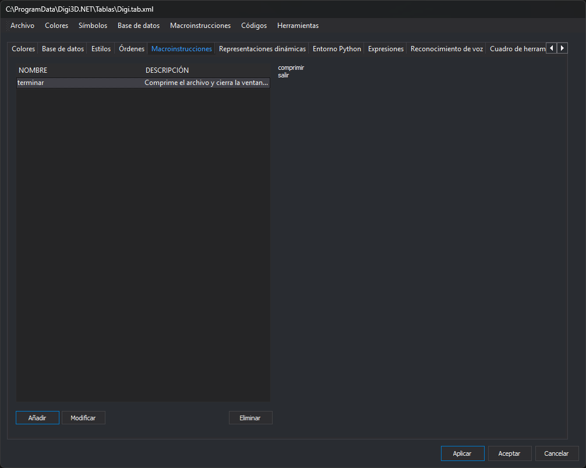

# Macroinstrucciones
<!-- id: macroinstrucciones-3 -->

Esta pestaña guarda [macroinstrucciones](/digi3d-ai/referencia/ordenes/formas-de-ejecutar-una-orden/ejecutar-una-orden-desde-la-linea-de-comandos/macroinstrucciones.md) en la tabla de códigos. Una macroinstrucción es una lista de órdenes con un nombre.

## Controles

* **Lista de macroinstrucciones**, con las columnas **Nombre** y **Descripción**.
* **Contenido**: el cuadro de la derecha muestra, sin permitir editarlas, las órdenes de la macroinstrucción seleccionada.
* **Añadir**: abre el cuadro de diálogo **Nueva macroinstrucción**, que pide el **Nombre** y una **Descripción (opcional)**. Si ya existe una macroinstrucción con ese nombre, sin distinguir mayúsculas de minúsculas, el editor muestra un mensaje y no la añade. Si no existe, se abre el cuadro **Editor de código** para escribir las órdenes, una por línea.
* **Modificar**: abre el **Editor de código** con las órdenes de la macroinstrucción seleccionada. No cambia el nombre ni la descripción.
* **Eliminar**: elimina la macroinstrucción seleccionada.

**Modificar** y **Eliminar** se habilitan al seleccionar una fila.

## Menú Macroinstrucciones

**Importar macroinstrucciones de un directorio...** pide una carpeta y añade una macroinstrucción por cada archivo de esa carpeta cuyo nombre empieza por `@`. El nombre de la macroinstrucción es el del archivo, y su contenido, las líneas del archivo. No comprueba si el nombre ya existe.

Los cambios de esta pestaña se aplican a la tabla de códigos al pulsar **Aplicar** o **Aceptar**.
