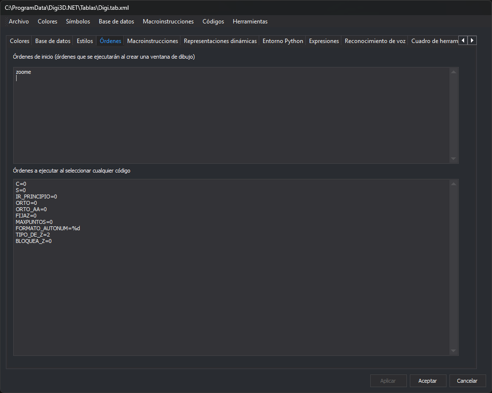

# Órdenes
<!-- id: ordenes-4 -->



Esta pestaña configura órdenes que Digi3D.AI [ejecuta automáticamente](/digi3d-ai/referencia/ordenes/formas-de-ejecutar-una-orden/al-seleccionar-un-codigo.md) en la ventana de dibujo con esta tabla de códigos cargada. Cada cuadro de texto admite una orden por línea.

## Órdenes de inicio

**Órdenes de inicio (órdenes que se ejecutarán al crear una ventana de dibujo)**: órdenes que se ejecutan al abrir una ventana de dibujo con esta tabla de códigos.

Por ejemplo, la siguiente orden hace un zoom extendido del modelo al abrir la ventana de dibujo:

```text
zoome
```

## Órdenes a ejecutar al seleccionar cualquier código

**Órdenes a ejecutar al seleccionar cualquier código**: órdenes que se ejecutan cada vez que cambia el código activo, sea cual sea el código. Las órdenes propias de cada código se configuran en su propiedad **Órdenes (seleccionar código)** de la pestaña [Códigos](codigos/propiedades-del-codigo.md).

Por ejemplo, estas órdenes desactivan ciertas variables al cambiar de código:

```text
C=0
S=0
IR_PRINCIPIO=0
ORTO=0
ORTO_AA=0
FIJAZ=0
MAXPUNTOS=0
FORMATO_AUTONUM=%d
TIPO_DE_Z=2
BLOQUEA_Z=0
```

Los cambios de esta pestaña se aplican a la tabla de códigos al pulsar **Aplicar** o **Aceptar**.
