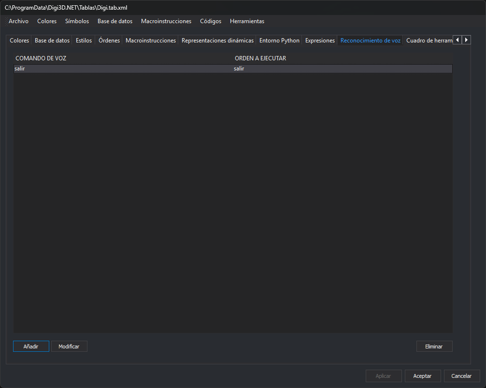

# Reconocimiento de voz
<!-- id: reconocimiento-de-voz -->

Esta pestaña configura comandos de voz: frases que, al reconocerlas el servicio de reconocimiento de voz de Windows, ejecutan una orden. Digi3D.AI solo escucha si la variable [RECONOCER\_VOZ](/digi3d-ai/referencia/ventana-de-dibujo/variables/r/reconocer-voz.md) está activada.

## Controles

* **Lista de comandos**, con las columnas **Comando de voz** y **Orden a ejecutar**.
* **Añadir**: abre el cuadro de diálogo **Comando de voz**, con dos campos:
  * **Comandos de voz (separados por punto y coma;)**: una o varias frases que ejecutan la orden, separadas por `;`.
  * **Orden a ejecutar**: la orden que se ejecuta al reconocer cualquiera de las frases.
* **Modificar**: abre el mismo cuadro con los datos del comando seleccionado.
* **Eliminar**: elimina el comando seleccionado.

**Modificar** y **Eliminar** se habilitan al seleccionar un comando.

Los cambios de esta pestaña se aplican a la tabla de códigos al pulsar **Aplicar** o **Aceptar**.
