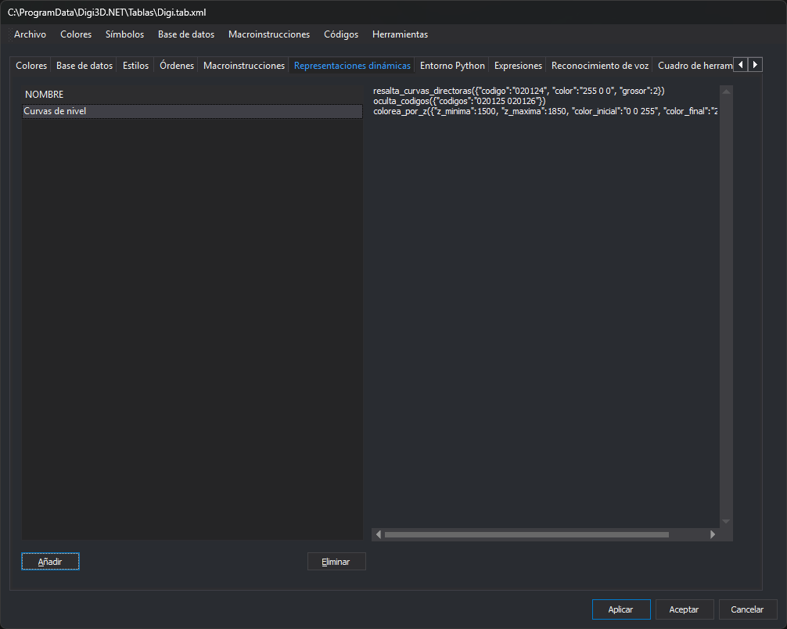
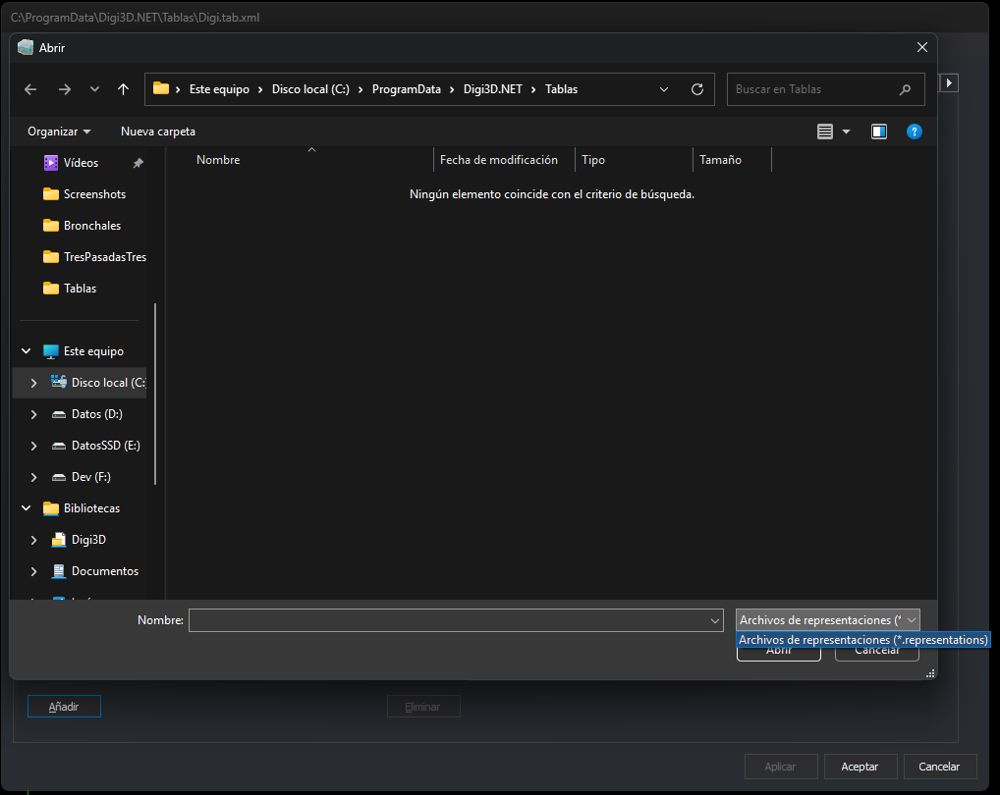

# Representaciones dinámicas
<!-- id: representaciones-dinamicas -->

Esta pestaña guarda en la tabla de códigos listas de reglas de representación dinámica. Cada lista procede de un archivo `.representations` creado con el cuadro de diálogo de la orden [ASIGNAR\_REPRESENTACIONES](/digi3d-ai/referencia/ventana-de-dibujo/ordenes/a/asignar-representaciones.md).

Las reglas son funciones Python de la pestaña [Entorno Python](entorno-python.md) con el decorador `@dynamic_representation_rule()`. Un archivo `.representations` es un archivo de texto con una regla por línea y los valores de sus parámetros.

## Controles

* **Lista de representaciones** (columna **Nombre**): una fila por representación dinámica de la tabla de códigos.
* **Contenido**: el cuadro de texto de la derecha muestra, sin permitir editarlo, el contenido de la representación seleccionada.
* **Añadir**: abre el cuadro de diálogo **Abrir** para elegir un archivo `.representations`. La representación toma como nombre el del archivo sin extensión, y como contenido, el texto del archivo. Si ya existe una representación con ese nombre, su contenido se sustituye por el del archivo.

  
* **Eliminar**: elimina la representación seleccionada. Se habilita al seleccionar una fila.

Para cambiar el contenido de una representación, edita el archivo `.representations` y añádelo otra vez.

## Dónde se usan

Con la tabla de códigos activa en la ventana de dibujo, los nombres de sus representaciones dinámicas aparecen en el menú **Ver/Representaciones dinámicas**. Elegir uno aplica esa lista de reglas a la representación de las geometrías. La orden [REPRESENTACION\_DINAMICA](/digi3d-ai/referencia/ventana-de-dibujo/ordenes/r/representacion-dinamica.md) hace lo mismo con el nombre como parámetro.

Los cambios de esta pestaña se aplican a la tabla de códigos al pulsar **Aplicar** o **Aceptar**.
