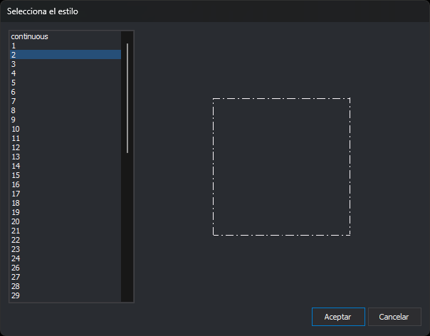

# Selecciona el estilo
<!-- id: selecciona-el-estilo -->

Este cuadro de diálogo permite elegir uno de los [estilos](estilos.md) de la tabla de códigos. Lo abren:

* El botón **Añadir** de las representaciones en la pestaña [Códigos](codigos/README.md), que añade al código una representación con el estilo elegido.
* El botón **Eliminar** de la pestaña [Estilos](estilos.md), cuando algún código usa el estilo que se elimina y eliges el sustituto.
* **Herramientas/Comprobaciones/Códigos/Códigos con estilos inexistentes**, para sustituir los estilos que no existen. Consulta [Comprobaciones](../menus/herramientas/comprobaciones.md).
* **Códigos/Importar códigos de archivo de definición de espacio de trabajo de ArcGIS...**, después de [Versión de ArcGIS](../menus/version-de-arcgis.md). En este caso el título es **Selecciona el estilo a asignar a los puntos**.

## Controles

* **Lista de estilos**: los estilos de la tabla de códigos en el orden de la pestaña **Estilos**. Al abrirse está seleccionado el primero. Hacer doble clic en un estilo equivale a seleccionarlo y pulsar **Aceptar**.
* **Vista previa**: a la derecha de la lista, dibuja un cuadrado con el estilo seleccionado, con el color del texto del tema.
* **Aceptar**: cierra el cuadro con el estilo seleccionado. Si no hay ningún estilo seleccionado, no hace nada.
* **Cancelar**: cierra el cuadro sin elegir ningún estilo.

El cuadro se puede redimensionar: la lista crece en altura y la vista previa en las dos direcciones. Al pulsar **Aceptar**, el editor guarda la posición y el tamaño del cuadro para la próxima vez.
