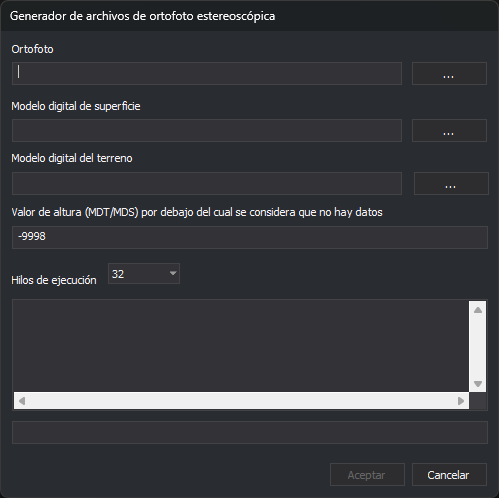

# Generador de archivos de Ortofoto Estereoscópica
<!-- id: generador-de-archivos-de-ortofoto-estereoscopica -->

Permite crear archivos HMP (*Height Map Pyramidal*, mapa de alturas piramidal) para el sensor [Ortofoto Estereoscópica](ventana-fotogrametrica/sensores/ortofoto-estereoscopica.md) de Digi3D.AI.

## Observaciones

El sensor Ortofoto Estereoscópica muestra estereoscópicamente ortofotos proyectando la ortofoto contra un modelo digital de superficies o un modelo digital del terreno.

Los archivos HMP deben tener al menos un modelo digital. Puedes crearlos con un modelo digital de superficies, un modelo digital del terreno o ambos.

El programa crea el archivo HMP en la carpeta de la ortofoto, con el mismo nombre y extensión `.hmp`. Si ya existe un archivo con ese nombre, lo sustituye.

## Ortofoto

Introduce aquí la ruta de la ortofoto. El botón **...** abre un cuadro de diálogo con los formatos de imagen que admite Digi3D.AI.

Si la ortofoto no es compatible con Digi3D.AI, el programa la convierte. Si no tiene niveles piramidales ni archivo `.pyr`, pregunta si quieres crearlos.

## Modelo digital de superficie

Introduce aquí uno o varios archivos con el modelo digital de superficie. El botón **...** permite seleccionar varios archivos a la vez y los añade, entre comillas, a los que ya hay en el campo.

Admite estos formatos:

| Extensión | Formato |
| :--- | :--- |
| `.tif` | Modelo digital en GeoTIFF. |
| `.asc` | Modelo digital en formato ASCII de ArcGIS. |
| `.las`, `.laz` | Nube de puntos LAS o LAZ. |
| `.e57` | Nube de puntos E57. |

Este campo no es obligatorio, pero en caso de no proporcionar un modelo digital de superficie el programa exigirá que se proporcione un modelo digital del terreno.

Para cada celda, el programa busca primero la altura en las nubes de puntos, después en los archivos GeoTIFF y por último en los archivos ASCII de ArcGIS, y usa el primer archivo que tiene datos en ese punto.

## Modelo digital del terreno

Introduce aquí uno o varios archivos con el modelo digital del terreno. Funciona igual que **Modelo digital de superficie** y admite los mismos formatos.

Este campo no es obligatorio, pero en caso de no proporcionar un modelo digital del terreno el programa exigirá que se proporcione un modelo digital de superficie.

## Valor de altura (MDT/MDS) por debajo del cual se considera que no hay datos

Las alturas iguales o inferiores a este valor se consideran celdas sin datos. El valor por defecto es -9998. Las celdas del archivo HMP sin datos en ninguno de los modelos digitales reciben este valor.

## Hilos de ejecución

Este desplegable permite indicar cuántos hilos de ejecución utilizar. Ofrece de 1 al número de procesadores lógicos del ordenador, y por defecto selecciona el máximo.

Cuanto mayor sea este valor, más rápido será el proceso, pero más lentas se volverán el resto de las tareas del sistema operativo.

## Resultados

Debajo de **Hilos de ejecución**, el cuadro de texto muestra el nivel piramidal que se está creando y los errores y advertencias de la lectura de los archivos TIFF, y la barra de progreso el avance del nivel en curso.

## Aceptar

Pulsa este botón para comenzar el proceso de creación del archivo de ortofoto estereoscópica.

Este botón se habilita únicamente si la ortofoto indicada existe y se ha rellenado al menos uno de los dos campos de modelo digital.

Si ninguno de los modelos digitales solapa con la ortofoto, el programa lo indica y no empieza el proceso. Mientras dura el proceso, todos los campos y los botones quedan deshabilitados.

Al terminar, el programa muestra un mensaje y vacía los campos **Ortofoto** y **Modelo digital de superficie**. Si alguna tesela no se ha podido crear, el mensaje indica cuántas han quedado vacías. Si el proceso falla, el programa muestra el motivo y conserva los campos para que puedas volver a intentarlo.

## Cancelar

Pulsa este botón para finalizar el programa. Mientras dura el proceso no está disponible.
