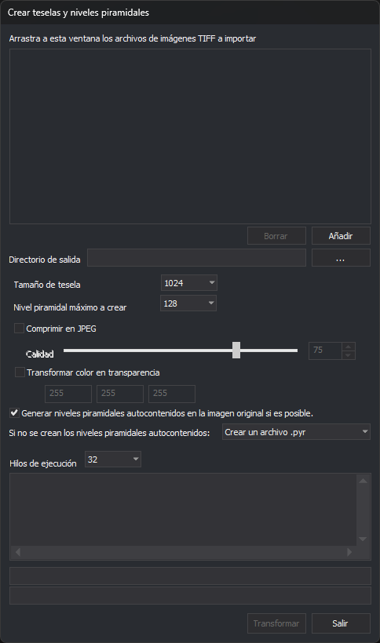

# Generador de Niveles Piramidales
<!-- id: generador-de-niveles-piramidales -->

Este programa transforma imágenes TIFF en batería para hacerlas compatibles con Digi3D.AI y crea niveles piramidales. Su ventana se titula **Crear teselas y niveles piramidales**.

## Observaciones

Digi3D.AI requiere que las imágenes TIFF estén teseladas (formadas por un mosaico de imágenes pequeñas).

Digi3D.AI requiere además que las imágenes TIFF tengan niveles piramidales (que son la misma imagen, pero a distintas resoluciones). Estos niveles piramidales pueden estar autocontenidos dentro de la propia imagen TIFF o en un archivo externo (habitualmente un archivo con extensión .pyr, que es en realidad un archivo TIFF al que se le ha cambiado la extensión a .pyr y que tiene los niveles piramidales 2, 3, 4,...).

Si al cargar en Digi3D.AI una imagen TIFF el programa detecta que esta no está formada por teselas, mostrará un cuadro de diálogo solicitando si convertirla en compatible.&#x20;

Si al cargar en Digi3D.AI una imagen TIFF el programa detecta que está teselada pero no tiene niveles piramidales, Digi3D.AI **no va a preguntar** si convertir la imagen en una imagen compatible, puesto que ya es compatible.

Con el programa Generador de Niveles Piramidales puedes realizar en batería lo siguiente:

* Convertir un conjunto de imágenes TIFF no compatibles (sin teselas) en compatibles y de paso generarles sus niveles piramidales.
* Crear los niveles piramidales de imágenes TIFF que ya están teseladas pero no los tienen. El programa no modifica la imagen: crea los niveles piramidales en un archivo externo.

Si una imagen ya está teselada y tiene niveles piramidales, el programa no hace nada con ella y lo indica en la ventana de resultados.

## Arrastra a esta ventana los archivos de imágenes TIFF a importar

Abre un explorador de archivos, selecciona los archivos a transformar y suéltalos en la lista mediante la técnica de Arrastrar y Soltar.

De entre todos los archivos que arrastres, el programa solo añade a la lista los que tienen extensión .tif o .tip. Un archivo que ya está en la lista no se añade otra vez.

Si arrastras una carpeta, el programa pregunta si quieres incluir los archivos .TIFF de esa carpeta y de sus subcarpetas. Si contestas **Sí**, añade los archivos .tif de la carpeta y de todas sus subcarpetas; si contestas **No**, no añade ningún archivo de la carpeta. La pregunta aparece una sola vez cada vez que arrastras, aunque sueltes varias carpetas.

### Botón Borrar

Elimina de la lista el archivo seleccionado. La lista solo permite seleccionar un archivo cada vez, así que para quitar varios hay que pulsar el botón una vez por cada uno. El botón está deshabilitado si no hay ningún archivo seleccionado.

### Botón Añadir

Abre un cuadro de diálogo que permite seleccionar uno o varios archivos con extensión .tif, .smti o .pyr y los añade a la lista.

## Directorio de salida

Este campo es opcional. El botón **...** abre el selector de carpetas.

* Si indicas un directorio, el programa genera las imágenes resultantes en ese directorio con el mismo nombre que la imagen original, y crea el directorio si no existe. Admite [sustituidores](cuadros-de-dialogo/sustituidores.md); si la ruta cambia al sustituirlos, la ventana de resultados muestra la ruta resultante.
* Si lo dejas vacío, el programa renombra la imagen original añadiendo a su nombre el sufijo `__0` (o `__1`, `__2`... si ya existe) y guarda la imagen nueva con el nombre original.

## Tamaño de tesela

Indica el tamaño en píxeles de las teselas a crear: 64, 128, 256, 512, 1024, 2048 o 4096. El valor por defecto es 1024.

## Nivel piramidal máximo a crear

Selecciona aquí el nivel piramidal máximo a crear, entre 1 y 8192. El valor por defecto es 128. Este nivel será el máximo que podrá seleccionarse en el desplegable de niveles piramidales de la barra de estado de la ventana fotogramétrica.

## Comprimir en JPEG

Selecciona esta opción si quieres que el programa comprima la imagen generada en formato JPEG. Por defecto está desactivada.\
No es habitual seleccionar esta opción pues Digi3D.AI genera y carga archivos BigTIFF que no tienen limitación en el tamaño.

### Calidad

Selecciona la calidad del JPEG, entre 0 y 100, con la barra deslizante o escribiendo el valor. El valor por defecto es 75. Cuanto mayor sea la calidad, menos comprimida estará la imagen. Solo está habilitada si **Comprimir en JPEG** está activada.

## Transformar color en transparencia

Es posible que la imagen original no tenga canal de transparencia pero que tenga un color especial que signifique transparencia.

Si activas esta opción, el programa generará un archivo con canal de transparencia y los píxeles que tengan el color indicado se convertirán en transparentes. Por defecto está desactivada.

Al activarla se habilitan los tres campos para introducir los valores de Rojo, Verde y Azul que identifican el color transparente. Por defecto, 255, 255 y 255 (blanco).

## Generar niveles piramidales autocontenidos en la imagen original si es posible

Con esta opción, activada por defecto, los niveles piramidales se guardan dentro de la imagen resultante, de manera que el resultado es un único archivo TIFF con las teselas y con los niveles piramidales.

Solo es posible si el programa crea la imagen, es decir, si la imagen original no está teselada. Si la imagen original ya está teselada, el programa no la modifica y los niveles piramidales se crean siempre en un archivo externo.

### Si no se crean los niveles piramidales autocontenidos

Este desplegable permite indicar si los niveles piramidales externos se crean en un archivo .pyr (opción por defecto) o en un archivo TIFF por cada nivel piramidal.

## Hilos de ejecución

Este desplegable permite indicar cuántos hilos de ejecución utilizar. Ofrece de 1 al número de procesadores lógicos del ordenador, y por defecto selecciona el máximo. Cada hilo transforma un archivo de la lista.

Cuanto mayor sea este valor, más rápido será el proceso, pero más lentas se volverán el resto de tareas del sistema operativo.

## Transformar

Pulsa este botón para comenzar el proceso. Solo está habilitado si la lista tiene algún archivo. Mientras dura el proceso, los controles quedan deshabilitados, la ventana de resultados muestra el archivo y el nivel piramidal que se están creando, y las dos barras de progreso muestran el avance. Cada archivo transformado desaparece de la lista. Al terminar, el programa indica si el trabajo ha terminado bien o cuántos errores ha encontrado.

## Salir

Pulsa este botón para finalizar la aplicación. Si hay un proceso en marcha, el programa lo detiene antes de cerrarse.
