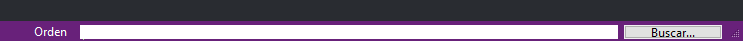
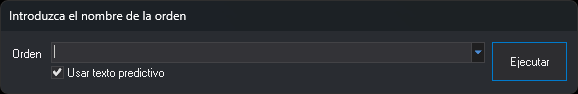

# Ejecutar una orden desde la línea de comandos
<!-- id: ejecutar-una-orden-desde-la-linea-de-comandos -->

En la ventana de dibujo, al pulsar **Intro** la barra de mensajes muestra un campo para escribir el nombre de la orden a ejecutar.

Escribe el nombre de la orden y pulsa **Intro** para ejecutarla.

Se pueden ejecutar tres tipos de órdenes:

* [Órdenes internas del programa](orden-interna-de-digi3d.ai.md)
* [Macroinstrucciones](/digi3d-ai/referencia/ventana-de-dibujo/ordenes/m/macroinstrucciones.md)
* [Guiones Python](/digi3d-ai/referencia/ordenes/formas-de-ejecutar-una-orden/ejecutar-una-orden-desde-la-linea-de-comandos/guiones-python.md)

## En la ventana fotogramétrica

En la ventana fotogramétrica, al pulsar **Intro** se abre el cuadro de diálogo **Introduce el nombre de la orden**. _Intro_ abre siempre este cuadro, aunque la tecla tenga órdenes asignadas en el teclado virtual activo.

* **Orden**: el nombre de la orden. Para pasarle parámetros, escribe el nombre, un signo igual (=) y los parámetros, por ejemplo `velocidad=5.75 4.22`. Todo lo que sigue al primer signo igual se pasa a la orden como parámetros.
* **Usar texto predictivo**: con la casilla marcada, la lista del campo **Orden** contiene en minúsculas los nombres de todas las [órdenes de la ventana fotogramétrica](/digi3d-ai/referencia/ventana-fotogrametrica/ordenes/README.md) y completa el nombre mientras se escribe. Con la casilla desmarcada, la lista contiene las órdenes ejecutadas desde este cuadro desde que se inició Digi3D.AI, ordenadas alfabéticamente, y el campo muestra la última orden ejecutada. Digi3D.AI guarda el estado de la casilla al pulsar **Ejecutar**.
* **Ejecutar**: cierra el cuadro y ejecuta la orden. Pulsar _Intro_ equivale a pulsar este botón.

Pulsa _Esc_ para cerrar el cuadro sin ejecutar ninguna orden.

Este cuadro solo ejecuta órdenes de la ventana fotogramétrica. También admite el nombre interno de la orden entre llaves, por ejemplo `{3BE1084C-E1BC-4b4f-AD45-611112560D6B}=5.75` para [VELOCIDAD](/digi3d-ai/referencia/ventana-fotogrametrica/ordenes/v/velocidad.md). Si el nombre no corresponde a ninguna orden de la ventana fotogramétrica, Digi3D.AI emite el sonido de error y no ejecuta nada.
