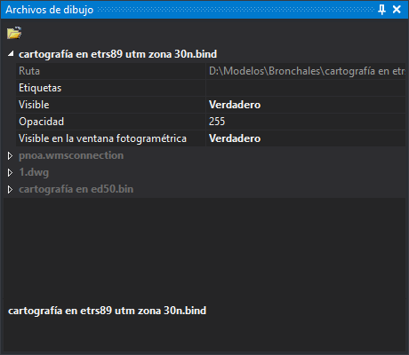

# Archivos de dibujo
<!-- id: panel-archivos-de-dibujo -->

Este panel muestra los archivos de dibujo cargados en la ventana de dibujo: el archivo de trabajo y los archivos de referencia. Cada archivo es un grupo con su nombre. El nombre del archivo activo aparece con el color de texto del tema (blanco con el tema oscuro) y el de los demás en gris.

## Barra de herramientas

* **Carga archivo de referencia**: carga un archivo de dibujo como referencia. Sus entidades no se pueden modificar.

## Campos de cada archivo

* **Ruta**: ruta completa del archivo. Es de solo lectura.
* **Etiquetas**: etiquetas separadas por comas que identifican el archivo en las órdenes que las admiten.
* **Visible**: si se dibujan las entidades del archivo en la ventana de dibujo.
* **Opacidad**: opacidad del archivo en la ventana de dibujo, de 0 (invisible) a 255 (opaco).
* **Visible en la ventana fotogramétrica**: si se dibujan las entidades del archivo en la ventana fotogramétrica.

Algunos formatos añaden campos propios al grupo del archivo.

## Menú contextual

Al hacer clic con el botón derecho sobre el nombre de un archivo aparecen estas opciones:

* **Zoom a la extensión del archivo**.
* **Zoom a la primera entidad del archivo** y **Zoom a la última entidad del archivo**: las entidades borradas no se tienen en cuenta.
* **Establecer como archivo activo**: el archivo pasa a ser el archivo de trabajo. Está deshabilitada en el archivo activo.
* **Descargar este archivo**: quita el archivo de la ventana de dibujo. Está deshabilitada en el archivo activo y cuando solo hay un archivo cargado. Al descargar un archivo se descargan también las topologías cargadas y la topología temporal.

  Si el formato del archivo guarda dentro del propio archivo la marca de las entidades borradas (por ejemplo, los formatos de base de datos), el archivo no es de solo lectura y tiene entidades marcadas como borradas, Digi3D.AI pregunta: «Quedan entidades marcadas como borradas que todavía no se han eliminado: […] ¿Desea comprimir ahora?».
  * **Sí**: comprime el archivo y lo descarga. Si no se puede comprimir, muestra un error y no lo descarga.
  * **No**: descarga el archivo sin comprimirlo.
  * **Cancelar**: no descarga el archivo.
* **Mostrar sistema de referencia de coordenadas horizontal...** y **Mostrar sistema de referencia de coordenadas vertical...**: muestran el sistema de referencia del archivo.

## Mostrar el panel

Selecciona la opción del menú **Ventana/Archivos de dibujo**.
