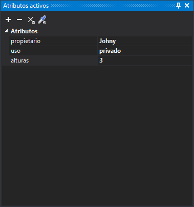
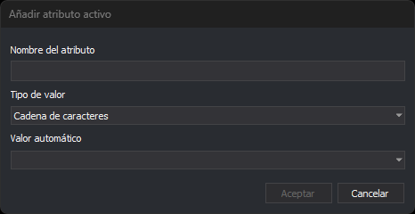

# Atributos Activos
<!-- id: atributos-activos -->

Este panel permite añadir atributos a asignar a la geometría.

Los atributos son pares clave-valor en los que se almacena información de cualquier tipo. Se pueden añadir hasta 65535 atributos a una geometría.

Los números con decimales se muestran y se escriben con punto (`12.5`), sea cual sea la configuración regional de Windows. Un valor numérico con coma da un error de conversión.

## Barra de herramientas

Dispone de una barra de herramientas que permite interactuar con el contenido del panel.

### Botones

* **Añadir atributo activo**: abre el cuadro de diálogo **Añadir atributo activo**.
* **Eliminar atributo seleccionado**: elimina el atributo activo seleccionado.
* **Limpiar**: elimina todos los atributos activos.
* **Clonar atributos**: ejecuta la orden [CLONAR\_ATRIBUTOS](../ventana-de-dibujo/ordenes/c/clonar_atributos.md), que sustituye los atributos activos por los de la geometría que selecciones.

Los botones están desactivados si no hay ninguna ventana de dibujo abierta.

## Cuadro de diálogo Añadir atributo activo

Añade un atributo a la lista de atributos activos.

* **Nombre del atributo**: nombre del atributo. Si ya hay un atributo activo con ese nombre, no se añade otro.
* **Tipo de valor**: tipo de dato del atributo: cadena de caracteres, entero con o sin signo de 8, 16, 32 o 64 bits, coma flotante de precisión simple o doble, o fecha. El atributo se añade con un valor vacío o cero, que se cambia después en el panel.
* **Valor automático**: opcional. Una de las [macros de base de datos](../editor-de-tablas-de-codigos/pestanas/base-de-datos/macros-de-base-de-datos.md), como `%UID%` o `%ENTITY_AREA%`. Digi3D.AI calcula su valor al almacenar cada entidad. Un atributo con valor automático no se puede editar en el panel.
* **Aceptar**: añade el atributo. Está desactivado mientras el nombre esté vacío.
* **Cancelar**: cierra el cuadro de diálogo sin añadir el atributo.

