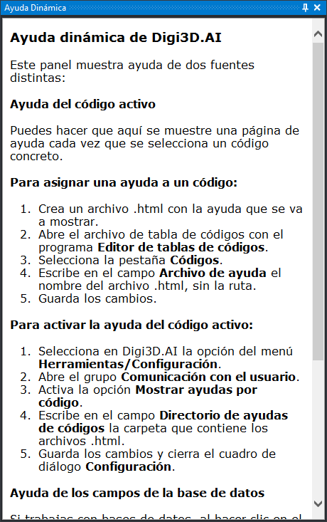

# Ayuda dinámica
<!-- id: ayuda-dinamica -->

Este panel muestra páginas HTML de ayuda. Al abrirlo muestra una página que explica cómo configurarlo. Después muestra:

* **La ayuda del código seleccionado.** Cada vez que se selecciona un código que tiene asignado un archivo de ayuda, el panel muestra ese archivo. Para que funcione:
  1. Escribe el nombre del archivo .html en el campo [Archivo de ayuda](../editor-de-tablas-de-codigos/pestanas/codigos/propiedades-del-codigo.md) del código, en el **Editor de tablas de códigos**.
  2. Activa la opción [Mostrar ayudas por código](../cuadros-de-dialogo/configuracion/comunicacion-con-el-usuario/mostrar-ayudas-por-codigo.md) del cuadro de diálogo **Configuración**.
  3. Indica en [Directorio de ayudas de códigos](../cuadros-de-dialogo/configuracion/comunicacion-con-el-usuario/directorio-de-ayudas-de-codigos.md) la carpeta que contiene los archivos .html.
* **La ayuda de un campo de la base de datos.** Al seleccionar un campo en el panel [Campos de la base de datos](campos-de-la-base-de-datos.md), el panel muestra su nombre, su descripción y, si el campo tiene una lista de valores, una tabla con el valor, el título y la descripción de cada uno.
* **Cualquier documento HTML** que se indique con la orden [MUESTRA_AYUDA](../ventana-de-dibujo/ordenes/m/muestra-ayuda.md), por ejemplo desde una macroinstrucción.

## Mostrar el panel

Se puede mostrar el panel de las siguientes formas:

* Pulsando el botón correspondiente en la [barra de herramientas Paneles](../barras-de-herramientas/paneles.md).
* Mediante la opción del menú **Ayuda/Ayuda dinámica**.
