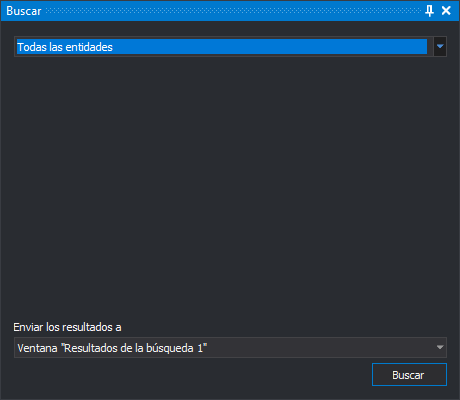
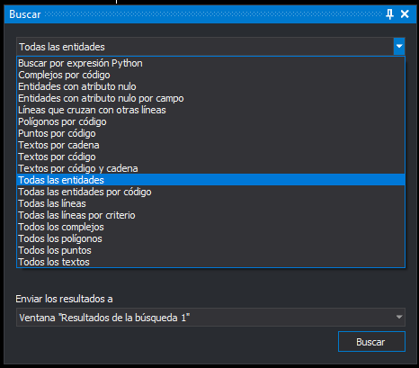

# Buscar
<!-- id: buscar-2 -->

Este panel busca entidades del archivo de dibujo según un criterio.

Los tipos de búsqueda que trae Digi3D.AI están en el repositorio de código abierto [DigiNG.Search](https://github.com/digi21/DigiNG.Search). Puedes consultar en él cómo está hecho cada tipo de búsqueda y usarlo como ejemplo para programar los tuyos.

## Campos

* **Tipo de búsqueda** (desplegable superior): el criterio de búsqueda. Según el tipo elegido, la zona central del panel muestra sus opciones.
* **Enviar los resultados a**: dónde se envían las entidades localizadas:
  * Ventana **Resultados de la búsqueda 1** o **Resultados de la búsqueda 2**.
  * **Orden activa**: la orden que se está ejecutando. Si la orden admite selección múltiple, recibe las entidades localizadas y realiza su tarea con ellas.
* **Buscar**: busca en el archivo de dibujo activo de la ventana de dibujo. Se habilita al elegir un tipo de búsqueda; si no hay ninguna ventana de dibujo abierta, no hace nada.

## Tipos de búsqueda

* Buscar por expresión Python
* Complejos por código
* Entidades con atributo nulo
* Entidades con atributo nulo por campo
* Líneas que cruzan con otras líneas
* Polígonos por código
* Puntos por código
* Textos por cadena
* Textos por código
* Textos por código y cadena
* Todas las entidades
* Todas las entidades por código
* Todas las líneas
* Todas las líneas por criterio
* Todos los complejos
* Todos los polígonos
* Todos los puntos
* Todos los textos

## Mostrar el panel

Selecciona la opción del menú **Editar/Buscar**.

## Ejemplo

Para exportar todos los textos del archivo de dibujo a un archivo nuevo:

1. Selecciona la opción del menú **Archivo/Exportar entidades seleccionadas...**.
2. Abre el panel con la opción **Editar/Buscar**.
3. Selecciona el tipo de búsqueda **Todos los textos**.
4. En **Enviar los resultados a**, selecciona **Orden activa**.
5. Pulsa **Buscar**.
6. Escribe el nombre del archivo a crear y pulsa **Guardar**.
