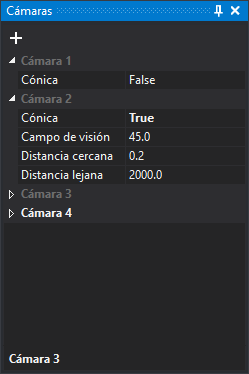

# Cámaras
<!-- id: panel-camaras -->

Este panel define las cámaras con las que la ventana de dibujo muestra el dibujo en perspectiva. Cada cámara es un grupo con su nombre. El nombre de la cámara activa aparece en blanco y el de las demás en gris. Para activar otra cámara, haz clic en su nombre.

## Barra de herramientas

* **Añadir cámara**: añade una cámara con los mismos parámetros que la cámara activa y la hace activa.

## Campos de cada cámara

* **Cónica**: si la proyección es cónica (**Verdadero**) u ortogonal (**Falso**). Los tres campos siguientes solo aparecen en las cámaras cónicas.
* **Campo de visión**: campo de visión vertical, en grados sexagesimales.
* **Distancia cercana**: distancia de la cámara al plano cercano. Lo que está más cerca que ese plano no se representa.
* **Distancia lejana**: distancia de la cámara al plano lejano. Lo que está más allá de ese plano no se representa.

## Mostrar el panel

Selecciona la opción del menú **Ventana/Cámaras**.
