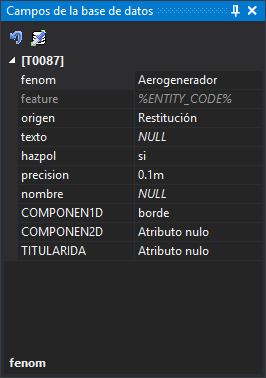

# Campos de la base de datos
<!-- id: campos-de-la-base-de-datos -->

Este panel muestra los campos de la tabla de la base de datos asociada al código activo y los valores con los que se almacenarán en la base de datos las geometrías que se digitalicen con ese código. Se utiliza cuando el archivo de dibujo trabaja con base de datos.

Al cambiar el código activo, el panel muestra los campos de la tabla de ese código. El título de la categoría es el nombre de la tabla entre corchetes, por ejemplo «[T0087]».

## Campos

Cada fila es un campo de la tabla:

* El nombre del campo se muestra según la opción [Nombre a mostrar](../cuadros-de-dialogo/configuracion/base-de-datos/nombre-a-mostrar.md) de la configuración.
* No se muestran los campos de clave principal, los de tipo lógico ni los marcados como no visibles en la tabla de códigos.
* Los campos que tienen un grupo en la tabla de códigos se muestran dentro de una subcategoría con el nombre del grupo.
* Los campos con una lista de valores posibles muestran un desplegable para elegir uno. La lista puede venir de la tabla de códigos o de una consulta `%SELECT …%` sobre la base de datos. Si la consulta falla, el campo muestra su valor almacenado sin desplegable.
* Si el campo tiene activada la opción **Mostrar cuadro de búsqueda** en la tabla de códigos, junto al desplegable aparece un botón con tres puntos que abre un cuadro para buscar el valor.
* Los campos que no se pueden modificar aparecen atenuados. Por ejemplo, los que deben almacenar siempre su valor por defecto.
* Un campo sin valor muestra el valor por defecto que define la tabla de códigos, si el código todavía no tiene registro en la base de datos y el campo tiene valor por defecto. En otro caso muestra *NULL*.
* Los valores que has cambiado se resaltan.

Si se produce un error al leer los campos, el panel añade al panel [Tareas](tareas.md) un error «Error al mostrar los campos de la base de datos», muestra el panel Tareas y abre un cuadro de diálogo con el mensaje «Se ha detectado un error al intentar mostrar los campos de la base de datos.». La sección **Más información** de ese cuadro indica el código, la tabla, el identificador del registro, la tabla de códigos, el modelo de datos y la cadena de conexión.

Al seleccionar un campo, la parte inferior del panel muestra su descripción, y el panel [Ayuda dinámica](ayuda-dinamica.md) muestra la descripción y la tabla de valores posibles, si la tiene.

El nombre, la descripción, el valor por defecto y la lista de valores de cada campo se configuran en las [propiedades de los campos](../editor-de-tablas-de-codigos/pestanas/base-de-datos/propiedades-de-los-campos.md) de la tabla de códigos.

## Barra de herramientas

* **Asignar los valores por defecto de la tabla de códigos**: sustituye los valores del panel por los valores por defecto que define la tabla de códigos para el código activo.
* **Clonar los campos de BBDD de una entidad**: ejecuta la orden [CLONAR_CAMPOS_BBDD](../ventana-de-dibujo/ordenes/c/clonar-campos-bbdd.md), que copia al panel los valores de los campos de la entidad que selecciones.

Los dos botones solo están habilitados si el panel muestra algún campo.

## Mostrar el panel

Se puede mostrar el panel de las siguientes formas:

* Mediante la opción del menú **Ventana/Campos de la base de datos**.
* Pulsando Alt+Mayús+B.
