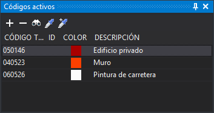

# Códigos activos
<!-- id: codigos-activos -->

Este panel permite seleccionar el código o códigos activos en caso de estar trabajando con multi codificación.

Al almacenar una geometría nueva, esta recibe todos los códigos de la lista, no solo el que está seleccionado. La lista solo admite una fila seleccionada a la vez.

La opción **Panel de multi-codificación** del campo [Interfaz para seleccionar código](../cuadros-de-dialogo/configuracion/diging/interfaz-para-seleccionar-codigo.md) de la configuración controla la opción de menú que muestra el panel y los botones **Añadir códigos**, **Seleccionar códigos**, **Copiar códigos de entidad** y **Añadir códigos de entidad**: sin esa opción están deshabilitados. La lista del panel y el botón **Quitar códigos** funcionan siempre.

Al añadir códigos a la lista:

* No se añade un código que ya está en la lista, salvo que la configuración permita geometrías con códigos repetidos.
* No se añaden los códigos desactivados en la tabla de códigos.
* Se borran la tabla, el **Id** y los atributos de base de datos de todos los códigos activos.

## Barra de herramientas

Dispone de una barra de herramientas que permite interactuar con el contenido del panel.

### Botones

* **Añadir códigos**: ejecuta la orden [COD+](/digi3d-ai/referencia/ventana-de-dibujo/ordenes/c/cod-mas.md), que añade códigos a la lista de códigos activos.
* **Quitar códigos**: quita el código seleccionado de la lista de códigos activos. Está deshabilitado si no hay ningún código seleccionado. El último código de la lista no se quita.
* **Seleccionar códigos**: ejecuta la orden [COD](/digi3d-ai/referencia/ventana-de-dibujo/ordenes/c/cod.md), que sustituye la lista de códigos activos por los códigos que selecciones.
* **Copiar códigos de entidad**: ejecuta la orden [CLONAR_CODIGOS](../ventana-de-dibujo/ordenes/c/clonar-codigos.md), que sustituye la lista de códigos activos por los de la entidad que selecciones.
* **Añadir códigos de entidad**: ejecuta la orden [CLONAR_CODIGOS+](../ventana-de-dibujo/ordenes/c/clonar-codigos-mas.md), que añade a la lista de códigos activos los de la entidad que selecciones.

## Columnas

* **Código**: nombre del código.
* **Tabla** e **Id**: tabla de la base de datos y número de registro asociados al código, si se trabaja con base de datos.
* **Color**: color del código en la tabla de códigos.
* **Descripción**: descripción del código en la tabla de códigos.

## Base de datos

Si estamos trabajando con una base de datos, al seleccionar un determinado código en este panel se forzará al panel [Campos de la base de datos](/digi3d-ai/referencia/paneles/campos-de-la-base-de-datos.md) en la tabla de códigos para el código seleccionado.

## Mostrar el panel

Se puede mostrar el panel de las siguientes formas:

* Mediante la opción del menú **Ventana/Códigos activos**.
* Pulsando Alt+Mayús+C.

Las dos solo están habilitadas con la opción **Panel de multi-codificación**.
