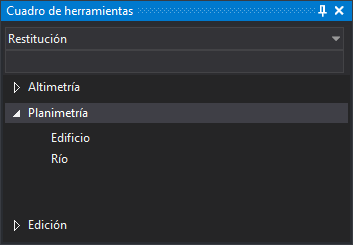

# Cuadro de herramientas
<!-- id: cuadro-de-herramientas -->

Este panel muestra el cuadro de herramientas configurado en la tabla de códigos activa.

## Ventanas del panel

El panel está compuesto por tres partes:

* Un desplegable que permite seleccionar la carpeta.
* Un cuadro de búsqueda que filtra las opciones del contenido principal.
* El contenido principal que muestra las distintas categorías y opciones de cada una de las categorías.

El desplegable y el cuadro de búsqueda están deshabilitados hasta que se carga una tabla de códigos.

Una vez seleccionada una carpeta, el programa muestra en el contenido principal todas las categorías de la carpeta. Las categorías tienen a su vez opciones.

## Búsqueda

Al escribir en el cuadro de búsqueda, el contenido principal muestra solo las opciones cuyo título o cuyas etiquetas contienen el texto escrito. La búsqueda no distingue mayúsculas de minúsculas. Las categorías sin ninguna opción que cumpla el filtro no se muestran.

## Ejecutar una opción

Al pulsar sobre una opción se ejecutan las órdenes configuradas en ella:

* Si la opción tiene una sola orden, se ejecuta esa orden.
* Si la opción tiene varias órdenes, se ejecutan en secuencia como una macroinstrucción.

Si no hay ninguna ventana de dibujo abierta, al pulsar una opción aparece el mensaje «Error: No hay ninguna vista activa» y no se ejecuta ninguna orden.

## Mostrar el panel

Se puede mostrar el panel de las siguientes formas:

* Pulsando el botón correspondiente en la [barra de herramientas Paneles](../barras-de-herramientas/paneles.md).
* Mediante la opción del menú **Ventana/Cuadro de herramientas**.

## Configuración del cuadro de herramientas

El cuadro de herramientas mostrará el contenido configurado en la [pestaña Cuadro de herramientas](/digi3d-ai/referencia/editor-de-tablas-de-codigos/pestanas/cuadro-de-herramientas.md) del programa [Editor de Tablas de Códigos](../editor-de-tablas-de-codigos/).
