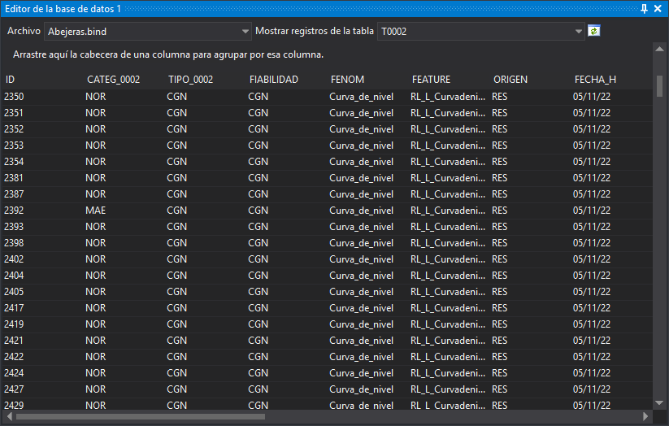

# Editor de la base de datos 1,2,3,4
<!-- id: editor-de-la-base-de-datos-1-2-3-4 -->

Permite consultar y editar la base de datos conectada con un determinado archivo de dibujo.

Hay cuatro paneles iguales (**Editor de la base de datos 1** a **4**), de modo que puedes tener a la vista varias tablas a la vez.

## Barra de herramientas

* **Archivo**: archivo de dibujo cuya base de datos se muestra. El desplegable contiene el archivo de dibujo principal y los archivos de referencia cargados.
* **Mostrar registros de la tabla**: tabla de la base de datos cuyos registros se muestran.
* **Expresión Python**: solo aparece si en [Tablas/Registros a mostrar](../cuadros-de-dialogo/configuracion/editor-de-la-base-de-datos/tablas-registros-a-mostrar.md) está seleccionada la opción **Mostrar geometrías que cumplan expresión Python**. Se muestran los registros de las geometrías que cumplen la expresión.
* **Regenerar**: vuelve a leer los registros de la tabla seleccionada. Se habilita al seleccionar una tabla.

## Registros

Cada fila es un registro de la tabla y cada columna, un campo. Puedes arrastrar la cabecera de una columna a la zona superior para agrupar los registros por ese campo.

* Al hacer doble clic sobre un registro, la ventana de dibujo actúa según la opción [Acción al hacer doble clic](../cuadros-de-dialogo/configuracion/editor-de-la-base-de-datos/accion-al-hacer-doble-clic.md) y selecciona temporalmente, durante 2 segundos, la geometría enlazada con ese registro.
* Al pulsar con el botón derecho del ratón sobre los registros, el menú contextual muestra la opción **Enviar selección a la orden activa**. Esta opción solo está habilitada si la orden activa admite selección de geometrías. Envía a la orden las geometrías enlazadas con el primer registro seleccionado.
* Los valores solo se pueden modificar si la opción [Permitir editar la base de datos](../cuadros-de-dialogo/configuracion/editor-de-la-base-de-datos/permitir-editar-la-base-de-datos.md) está activada. Si la base de datos está abierta en solo lectura, los valores no se pueden modificar aunque la opción esté activada.
* Cada valor modificado se escribe en la base de datos al validar la celda.

Las tablas y los registros que se muestran dependen de la opción [Tablas/Registros a mostrar](../cuadros-de-dialogo/configuracion/editor-de-la-base-de-datos/tablas-registros-a-mostrar.md).

## Mostrar el panel

Se puede mostrar el panel de las siguientes formas:

* Pulsando el botón correspondiente en la [barra de herramientas Paneles](../barras-de-herramientas/paneles.md).
* Mediante las opciones del menú **Base de datos/Editor de la base de datos 1** a **Base de datos/Editor de la base de datos 4**.
* Pulsando Alt+Mayús+E, que muestra el panel **Editor de la base de datos 1**.
