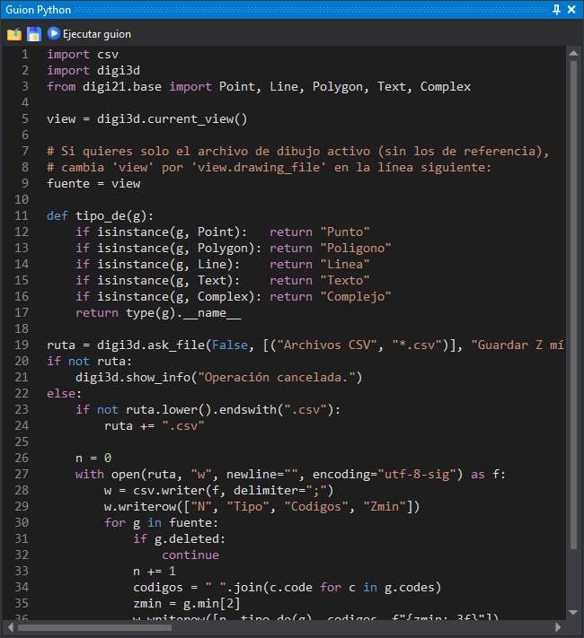

# Guion Python
<!-- id: guion-python -->

Este panel es un editor de guiones de Python con resaltado de sintaxis. El guion se ejecuta en el intérprete de Python de Digi3D.AI, con acceso a la ventana de dibujo activa mediante el módulo `digi3d`. Se explica en [Panel de Python](../../programacion/python/panel-de-python/README.md).

## Barra de herramientas

* **Cargar guion**: abre un archivo `.py` y muestra su contenido en el editor.
* **Guardar guion**: guarda el contenido del editor en un archivo `.py`.
* **Ejecutar guion**: ejecuta el contenido del editor.

## Ejecución del guion

* Si hay una ventana de dibujo activa, los cambios que hace el guion en el archivo de dibujo forman una sola transacción: una sola orden [UNDO](../ventana-de-dibujo/ordenes/u/undo.md) los deshace todos.
* Si el guion lanza una excepción, su mensaje se muestra en un cuadro de mensaje.

## Mostrar el panel

Se puede mostrar el panel mediante la opción del menú **Ventana/Guion Python**.

El panel solo existe si el valor de registro `CrearPanelPython` es distinto de 0. Por defecto vale 1.

## Véase también

* [Cómo ejecutar guiones](../../programacion/python/panel-de-python/ejecutar-guiones.md): desde el panel, como una orden y como control de calidad.
* [Ejemplos de programación](../../programacion/python/panel-de-python/ejemplos/README.md).
* [PYTHON](../ventana-de-dibujo/ordenes/p/python.md): orden que ejecuta un archivo de guion.
