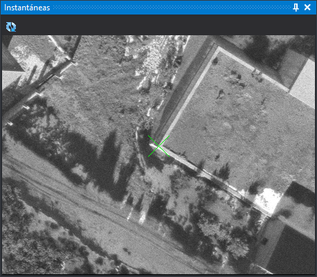

# Instantáneas
<!-- id: panel-instantaneas -->

Este panel muestra la instantánea del punto que se está midiendo: la imagen que se guardó al medir ese mismo punto en una orientación anterior. La cruz señala la posición del punto en la instantánea, de modo que puedes localizarlo en el modelo.

El panel aparece automáticamente en la ventana fotogramétrica al ejecutar la orden [AEROTRI](../ventana-fotogrametrica/ordenes/a/aerotri.md) (opción **Medida de aerotriangulación** del menú **Orientaciones**) y se cierra al terminarla. No se puede abrir desde ningún otro sitio.

## Barra de herramientas

* **Rotar instantánea**: gira la instantánea 180°. Es útil cuando el punto se midió en una pasada en sentido contrario a la actual. El botón queda pulsado mientras la instantánea está girada.

## Generación de las instantáneas

El panel solo muestra algo si al medir los puntos se guardaron sus instantáneas:

* Activa la opción [Almacenar instantánea](../cuadros-de-dialogo/configuracion/orientacion-absoluta/almacenar-instantanea.md) de la configuración.
* El directorio y el tamaño de las instantáneas se configuran en [Instantáneas](../cuadros-de-dialogo/configuracion/instantaneas/README.md).
