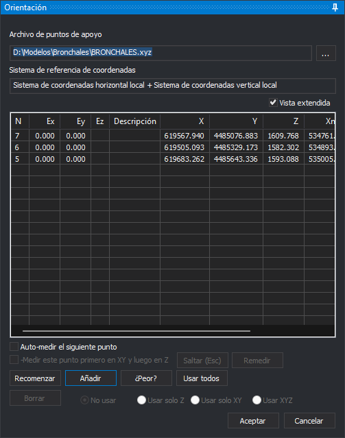

# Orientación
<!-- id: panel-orientacion -->

Este panel mide los puntos de apoyo de la orientación de los sensores que no tienen un panel propio y muestra los residuos. Lo abren estas opciones:

* **Orientación afín**, del sensor [Ortofoto](../ventana-fotogrametrica/sensores/ortofoto.md).
* **Orientación externa**, del sensor cónico monoscópico.
* Las opciones de orientación de los sensores [ADS](../ventana-fotogrametrica/sensores/ads.md) y [Satélite RPC](../ventana-fotogrametrica/sensores/rpc/README.md) monoscópico.

El título del panel es el de la orientación que se mide: «Orientación afín», «Orientación externa» u «Orientación». Si el sensor activo no admite esta orientación, Digi3D.AI muestra «El sensor activo no permite ejecutar esta orden.» y no abre el panel.

Antes de abrir el panel, Digi3D.AI carga el último archivo de puntos de apoyo usado. Si no lo puede leer, muestra «No se pudo cargar el archivo de puntos de apoyo.» y abre el cuadro de diálogo [Archivo de puntos de apoyo](../cuadros-de-dialogo/archivo-de-puntos-de-apoyo.md). Si cancelas ese cuadro de diálogo, el panel no se abre.

En la orientación afín, y en las demás cuando el modelo aún no tiene la orientación, el panel pide el primer punto nada más abrirse con el cuadro de diálogo [Introduce un punto terreno del archivo de puntos](../cuadros-de-dialogo/introduce-punto-terreno.md). Después de elegirlo, mide el punto en la ventana fotogramétrica. La línea de mensajes, sobre **Aceptar**, indica qué punto hay que digitalizar.

Los botones que no se pueden usar en cada momento aparecen desactivados.

* **Archivo de puntos de apoyo**: archivo con las coordenadas terreno de los puntos. El botón **...** abre el cuadro de diálogo [Archivo de puntos de apoyo](../cuadros-de-dialogo/archivo-de-puntos-de-apoyo.md) para cambiarlo.
* **Sistema de referencia de coordenadas**: el sistema de las coordenadas del archivo de puntos.
* **Vista extendida**: añade a la lista las coordenadas terreno (**X**, **Y**, **Z**) y modelo (**Xmod**, **Ymod**, **Zmod**) de cada punto. Digi3D.AI recuerda su estado. Con la vista extendida, la lista es más ancha que el panel y aparece una barra de desplazamiento horizontal; ensancha el panel para ver todas las columnas.
* **Lista de puntos medidos**: el nombre de cada punto (**N**), sus residuos en X, Y y Z (**Ex**, **Ey**, **Ez**) y su **Descripción**. Los residuos aparecen cuando hay al menos tres puntos medidos. Hacer clic en un punto lleva el cursor a él.
* **Auto-medir el siguiente punto**: cuando hay puntos suficientes para calcular la orientación, al medir un punto el panel lleva el cursor al siguiente punto del archivo que cae dentro de la imagen.
* **Primero XY, luego Z**: el punto se mide en dos pasos: el primer dato registra la posición en planta y el segundo, la Z.
* **Saltar (Esc)**: mientras se espera la medida de un punto, lo descarta y pide el siguiente. Con un punto seleccionado en la lista, quita la selección.
* **Remedir**: lleva el cursor al punto seleccionado en la lista para volver a medirlo. Sin ningún punto seleccionado, muestra «No se ha seleccionado ningún punto para remedir en la lista de puntos.».
* **Recomenzar**: vuelve a medir, uno a uno, todos los puntos.
* **Añadir**: mide un punto nuevo. Abre el cuadro de diálogo [Introduce un punto terreno del archivo de puntos](../cuadros-de-dialogo/introduce-punto-terreno.md) para elegirlo.
* **¿Peor?**: selecciona el punto con el residuo más grande. Necesita al menos tres puntos medidos.
* **Usar todos**: vuelve a usar en X, Y y Z todos los puntos medidos.
* **Borrar**: elimina el punto seleccionado y vuelve a calcular la orientación.
* **No usar**, **Usar solo Z**, **Usar solo XY** y **Usar XYZ**: qué coordenadas del punto seleccionado intervienen en el cálculo.
* **Aceptar**: guarda la orientación y cierra el panel. Solo está disponible con al menos tres puntos medidos que intervienen en el cálculo. **Ctrl+Intro** hace lo mismo.
* **Cancelar**: cierra el panel y el modelo recupera la orientación que tenía.

## Orientación afín

La orientación afín del sensor Ortofoto calcula una transformación afín plana entre las coordenadas terreno y las de la imagen:

* Necesita tres puntos. La columna **Ez** queda vacía, porque la transformación no calcula la Z.
* El panel no conserva los puntos de una orientación afín anterior: al volver a abrirlo, la lista empieza vacía.
* Al aceptar, Digi3D.AI guarda la transformación como world file en la carpeta del proyecto, con el nombre de la imagen y la extensión formada por la primera y la tercera letra de su extensión seguidas de **w** (_.tfw_ para una imagen _.tif_), y su sistema de referencia en un archivo _.prj_ con el mismo nombre. Si no puede crear el world file, muestra «Error al crear el archivo: *ruta*» y el panel sigue abierto.
* La opción **Orientación afín** del menú aparece marcada cuando el modelo tiene una orientación afín.
