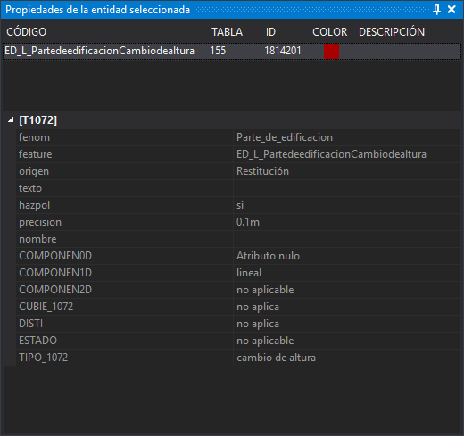

# Propiedades de la entidad seleccionada
<!-- id: propiedades-de-la-entidad-seleccionada -->

Este panel muestra los códigos y los atributos de la última geometría tentativada. Es de solo lectura: para modificar los atributos de base de datos se utiliza el panel [Editor de la base de datos 1,2,3,4](editor-de-la-base-de-datos-1-2-3-4.md).

El panel se actualiza cada vez que se tentativa una geometría con el botón de tentativo del ratón, también cuando el tentativo localiza la intersección de dos líneas. Seleccionar o deseleccionar geometrías no cambia el panel. El contenido se mantiene hasta que se tentativa otra geometría o se cierra la ventana de dibujo.

## Mostrar el panel

Se puede mostrar el panel mediante la opción del menú **Ventana/Propiedades de la entidad seleccionada**.

## Lista de códigos

La parte superior muestra los códigos de la geometría tentativada, uno por fila, en orden inverso: el último código de la geometría aparece en la primera fila.

* **Código**: nombre del código.
* **Tabla**: tabla de la base de datos a la que está enlazado el código.
* **ID**: identificador del registro de la base de datos enlazado con el código.
* **Color**: color del código en la tabla de códigos.
* **Descripción**: descripción del código en la tabla de códigos.

## Atributos

La parte inferior muestra:

* **Atributos**: los atributos de la geometría, si tiene alguno.
* Los campos de la base de datos de un código, en una categoría con el nombre de la tabla entre corchetes. Al tentativar la geometría se muestran los campos de su primer código, que es la última fila de la lista. Al pulsar sobre otro código de la lista se muestran los campos de su registro. No se muestra esta categoría si el código no está enlazado con la base de datos, si el código todavía no tiene un ID asignado o si el archivo de dibujo no tiene base de datos.

Los campos marcados como no visibles en la tabla de códigos no se muestran, salvo que se active la opción [Mostrar campos no visibles en el panel Propiedades de la entidad seleccionada](../cuadros-de-dialogo/configuracion/base-de-datos/mostrar-campos-no-visibles.md) de la configuración.
