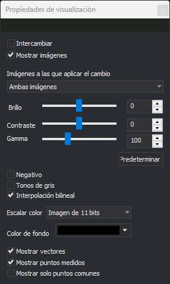

# Propiedades de visualización
<!-- id: propiedades-de-visualizacion -->

Este panel modifica cómo se dibujan las imágenes y los vectores en la ventana fotogramétrica activa.

## Campos

* **Intercambiar ojos**: muestra la imagen izquierda al ojo derecho y la imagen derecha al ojo izquierdo.
* **Mostrar imágenes**: si se desactiva, la ventana fotogramétrica solo dibuja los vectores. Los controles de radiometría se deshabilitan.
* **Imágenes a las que aplicar el cambio**: imágenes a las que se aplican el brillo, el contraste y la gamma: **Ambas imágenes**, **Imagen izquierda** o **Imagen derecha**.
* **Brillo**: de -100 a 100. El valor predeterminado es 0.
* **Contraste**: de -100 a 100. El valor predeterminado es 0.
* **Gamma**: de 0 a 300, en centésimas (100 equivale a una gamma de 1,0). El valor predeterminado es 100.
* **Predeterminar**: devuelve el brillo a 0, el contraste a 0 y la gamma a 100, y activa la interpolación bilineal.
* **Negativo**: invierte los colores de las imágenes.
* **Tonos de gris**: dibuja las imágenes en escala de grises.
* **Interpolación bilineal**: suaviza los píxeles al ampliar la imagen. Si se desactiva, cada píxel se dibuja como un cuadrado de color uniforme.
* **Escalar color**: número de bits significativos de las imágenes de 16 bits por banda. Digi3D.AI multiplica el valor de cada píxel para que ocupe el rango completo de 16 bits. Por ejemplo, con **Imagen de 11 bits** cada valor se multiplica por 32. Con **No escalar color** no se modifica.
* **Color de fondo**: color de las zonas de la ventana fotogramétrica que no cubre ninguna imagen.
* **Mostrar vectores**: dibuja las entidades de los archivos de dibujo sobre las imágenes.
* **Mostrar puntos medidos**: dibuja los puntos medidos en las orientaciones.
* **Mostrar solo puntos comunes**: dibuja solo los puntos medidos en las dos imágenes del modelo. Se habilita al activar **Mostrar puntos medidos**.

Digi3D.AI guarda el brillo, el contraste, la gamma, el negativo, el escalado de color y la interpolación bilineal en el registro del usuario, y los aplica al abrir la siguiente ventana fotogramétrica.

## Mostrar el panel

Selecciona la opción del menú **Ventana fotogramétrica/Propiedades de visualización...**.

## Ejemplo

Consulta [Cambiando la radiometría de las imágenes de la ventana fotogramétrica](../../primeros-pasos/comenzando-a-utilizar-digi3d.ai/comenzando-con-la-ventana-fotogrametrica/cambiando-radiometria-ventana-foto.md).
