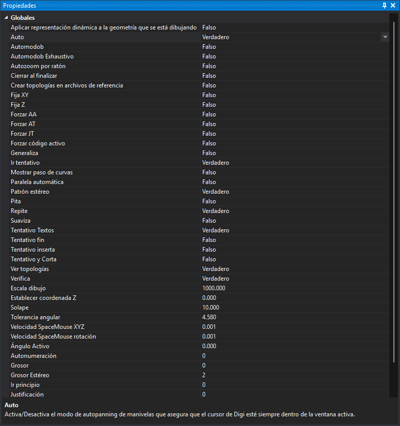

# Propiedades
<!-- id: propiedades -->

Este panel muestra el valor de las órdenes de tipo variable y permite cambiarlo. Cambiar un valor en el panel tiene el mismo efecto que ejecutar la orden con ese valor.

Aparecen las órdenes de tipo variable de Digi3D.AI y las de las extensiones cargadas:

* Las [variables booleanas](../ventana-de-dibujo/variables/variables-booleanas.md), con los valores **Verdadero** y **Falso**.
* Las [variables reales](../ventana-de-dibujo/variables/variables-reales.md), con tres decimales.
* Las [variables numéricas](../ventana-de-dibujo/variables/variables-numericas.md), con números enteros.

La parte inferior del panel muestra la descripción de la orden seleccionada.

## Mostrar el panel

Se puede mostrar el panel de las siguientes formas:

* Pulsando el botón correspondiente en la [barra de herramientas Paneles](../barras-de-herramientas/paneles.md).
* Mediante la opción del menú **Ventana/Propiedades**.
