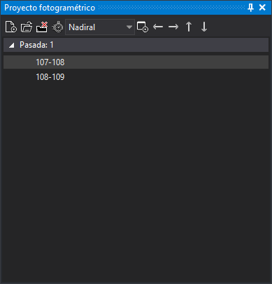

# Proyecto fotogramétrico
<!-- id: proyecto-fotogrametrico -->

Permite crear archivos de proyecto fotogramétrico, así como cargar archivos de proyectos fotogramétricos creados por otros programas.

Una vez cargado un proyecto fotogramétrico, el contenido principal muestra un árbol con tantas ramas como pasadas se enumeren en el archivo de proyecto fotogramétrico y con tantas hojas como modelos existan en el proyecto.

Al pulsar sobre un modelo se creará una ventana fotogramétrica mostrando dicho modelo o en caso de tener ya abierta una ventana fotogramétrica, se cambiará el modelo por el seleccionado.

Si el proyecto es de fotos y no de modelos, el panel muestra dos listas con las mismas fotos: la izquierda y la derecha. Al seleccionar una foto en cada lista se carga el modelo formado por las dos fotos.

El panel recuerda el último proyecto cargado y lo vuelve a cargar al iniciar Digi3D.AI, si el archivo sigue existiendo.

## Modelos que no se pueden cargar

Por defecto, el árbol solo muestra los modelos que se pueden cargar. Cada modelo que no se puede cargar añade al panel [Tareas](tareas.md) un error «Archivo de modelo: *modelo* no localizado.». Si no se puede cargar ningún modelo del proyecto, aparece el mensaje «No se ha podido cargar ningún modelo del archivo de proyecto. Posiblemente la ruta a las imágenes en el archivo de proyecto no es válida».

Si se desactiva la opción [Mostrar solo modelos cargados](../cuadros-de-dialogo/configuracion/proyecto-fotogrametrico/mostrar-solo-modelos-cargados.md) de la configuración, el árbol muestra también los modelos que no se pueden cargar, deshabilitados, y cada uno sigue añadiendo su error al panel Tareas.

## Sistema de referencia de coordenadas del proyecto

Si el proyecto no tiene asociado un sistema de referencia de coordenadas, al cargarlo aparece el cuadro «No hemos localizado el Sistema de Referencia de Coordenadas de este proyecto» con tres opciones:

* Indicar el sistema de referencia de coordenadas: muestra el cuadro de selección de sistema de referencia de coordenadas y, al aceptar, crea un archivo `.prj` junto al proyecto.
* Indicar que se desconoce: crea un archivo `.prj` con un sistema desconocido.
* Preguntar la próxima vez: asigna temporalmente un sistema desconocido y no crea ningún archivo `.prj`.

## Mensajes de error al cargar un proyecto

* «No hemos localizado ninguna extensión que permita abrir el archivo seleccionado.»: ningún sensor instalado reconoce el archivo.
* «El archivo de proyecto no proporciona ningún punto de vista, así que no se puede cargar ningún modelo de él.»
* «No se puede cargar un proyecto mientras se está cargando un modelo en segundo plano. Espere a que termine.»

## Barra de herramientas

Dispone de una barra de herramientas que permite interactuar con el contenido del panel.

### Botones

* **Nuevo**: crea un nuevo archivo de proyecto fotogramétrico.
* **Cargar**: carga un archivo de proyecto fotogramétrico existente. Sin licencia de fotogrametría, el botón no carga nada.
* **Descargar**: descarga el proyecto fotogramétrico cargado.

**Cargar** y **Descargar** están deshabilitados mientras se carga un modelo en segundo plano.
* **Cambio automático de modelo**: activa o desactiva el cambio automático de modelo.
* **Punto de vista**: desplegable que permite seleccionar el punto de vista en caso de que el archivo de proyecto fotogramétrico cargado proporcione distintos puntos de vista desde una misma estación.
* **Abrir en ventana nueva**: si está activado, al pulsar sobre un modelo se abre en una ventana fotogramétrica nueva en lugar de cambiar el modelo de la ventana fotogramétrica activa.
* **Ir al modelo anterior** e **Ir al siguiente modelo** (flechas izquierda y derecha): cargan en la ventana fotogramétrica activa el modelo anterior o el siguiente de la misma pasada.
* **Ir al modelo de la pasada anterior** e **Ir al modelo de la pasada siguiente** (flechas arriba y abajo): cargan en la ventana fotogramétrica activa, de entre los modelos de la pasada anterior o de la siguiente, el más adecuado para la posición del cursor.

Los botones de las flechas solo están habilitados cuando hay un proyecto fotogramétrico cargado y una ventana fotogramétrica abierta.

## Mostrar el panel

Se puede mostrar el panel de las siguientes formas:

* Pulsando el botón correspondiente en la [barra de herramientas Paneles](../barras-de-herramientas/paneles.md).
* Mediante la opción del menú **Ventana/Proyecto fotogramétrico**.
