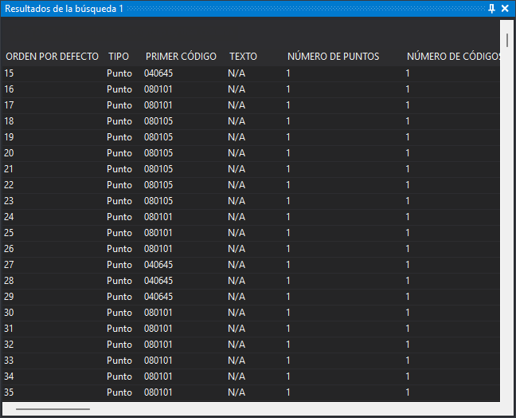

# Resultados de la búsqueda 1 y 2
<!-- id: resultados-de-la-busqueda-1-y-2 -->

Muestran las geometrías localizadas mediante el panel [Buscar](buscar.md). Hay dos paneles iguales para poder conservar los resultados de dos búsquedas a la vez.

Cada fila es una geometría. Las columnas **Orden** y **Tipo** se muestran siempre. El resto de columnas se configuran en el grupo [Resultados de la búsqueda](../cuadros-de-dialogo/configuracion/resultados-de-la-busqueda/README.md) del cuadro de diálogo de configuración.

## Interacción

* **Doble clic** sobre un resultado: selecciona temporalmente la geometría en la ventana de dibujo durante los [segundos configurados](../cuadros-de-dialogo/configuracion/resultados-de-la-busqueda/segundos-a-mostrar-la-entidad-seleccionada.md) y realiza la [acción configurada](../cuadros-de-dialogo/configuracion/resultados-de-la-busqueda/accion-al-hacer-doble-clic.md): un zoom extendido a la geometría, desplazar la cámara a su centro o mantener la vista.
* **Clic en la cabecera de una columna**: ordena los resultados por esa columna.
* **Arrastrar la cabecera de una columna** a la zona superior del panel: agrupa los resultados por esa columna.
* **Arrastrar la cabecera de una columna** fuera de la cabecera: quita esa columna del panel.
* **Menú contextual, Enviar selección a la orden activa**: pasa los resultados seleccionados a la orden en curso, si esta admite selección de geometrías. Se pueden seleccionar varios resultados con **Ctrl** y **Mayús**. Si la orden solo admite seleccionar una geometría, recibe únicamente el primer resultado seleccionado. Las geometrías borradas no se envían, salvo que la variable [BORRADOS](../ventana-de-dibujo/variables/b/borrados.md) valga 1.

Los resultados pertenecen a la ventana de dibujo en la que se hizo la búsqueda: con otra ventana de dibujo activa, el doble clic y el menú contextual no hacen nada. El panel se vacía al cerrar esa ventana de dibujo o al descartar el archivo de dibujo de los resultados.

## Mostrar el panel

Se puede mostrar el panel de las siguientes formas:

* Pulsando el botón correspondiente en la [barra de herramientas Paneles](../barras-de-herramientas/paneles.md).
* Mediante las opciones del menú **Ventana/Resultados de la búsqueda/Resultados de la búsqueda 1** y **Ventana/Resultados de la búsqueda/Resultados de la búsqueda 2**.
