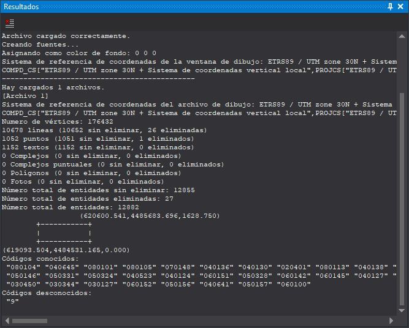

# Resultados
<!-- id: resultados -->

Este panel muestra los mensajes de Digi3D.AI y los resultados que escriben ciertas órdenes, como [BININFO](../ventana-de-dibujo/ordenes/b/bininfo.md). Cada mensaje se añade al final. Algunos mensajes desplazan además el panel hasta el final para mostrarlo; otros se añaden sin desplazarlo.

## Barra de herramientas

* **Limpiar**: borra el contenido del panel.

## Limpiar el panel desde el menú

La opción del menú **Ventana/Resultados/Limpiar resultados** ejecuta la orden [BORRA_BARRA_SALIDA](../ventana-de-dibujo/ordenes/b/borra-barra-salida.md), que borra el contenido del panel. La opción solo está habilitada si el panel tiene algún texto y solo actúa con una ventana de dibujo abierta.

## Mostrar el panel

Se puede mostrar el panel de las siguientes formas:

* Pulsando el botón correspondiente en la [barra de herramientas Paneles](../barras-de-herramientas/paneles.md).
* Mediante la opción del menú **Ventana/Resultados/Resultados**.
* Pulsando Alt+Mayús+R.
