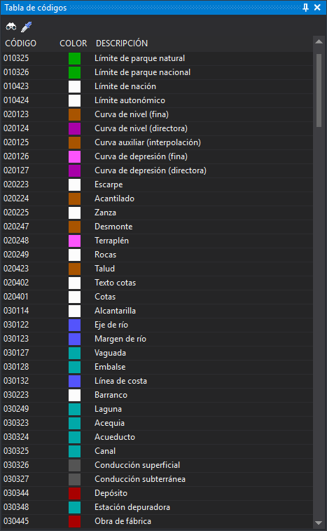

# Tabla de códigos
<!-- id: tabla-de-codigos -->

Este panel muestra todos los códigos de la tabla de códigos activa y permite seleccionar el código activo con un clic. Hace la misma función que la [barra de herramientas Código](../barras-de-herramientas/codigo.md), pero con todos los códigos a la vista.

Al hacer clic sobre un código, este pasa a ser el código activo de la ventana de dibujo activa.

El panel se habilita únicamente si se selecciona la opción **Panel de códigos (mono-codificación)** en el campo [Interfaz para seleccionar código](../cuadros-de-dialogo/configuracion/diging/interfaz-para-seleccionar-codigo.md) de la configuración del programa. El cambio requiere reiniciar Digi3D.AI. La opción se llama «Panel de códigos», pero el panel que crea se titula **Tabla de códigos**.

## Barra de herramientas

Los botones solo están habilitados si hay una ventana de dibujo abierta.

* **Seleccionar códigos**: ejecuta la orden [COD](../ventana-de-dibujo/ordenes/c/cod.md), que permite seleccionar el código activo en un cuadro de diálogo.
* **Copiar códigos de entidad**: ejecuta la orden [CLONAR_CODIGOS](../ventana-de-dibujo/ordenes/c/clonar-codigos.md), que asigna como código activo el de la entidad que se seleccione.

## Columnas

* **Código**: nombre del código.
* **Color**: color del código en la tabla de códigos.
* **Descripción**: descripción del código en la tabla de códigos.

## Mostrar el panel

Se puede mostrar el panel mediante la opción del menú **Ventana/Tabla de códigos**.
