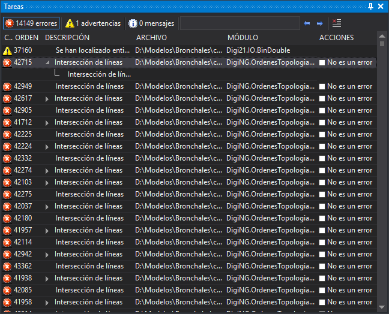

# Tareas
<!-- id: tareas -->

Este panel muestra las tareas (errores, advertencias y mensajes) que generan algunas órdenes, como [DETECTAR_LINEAS_NO_CONECTADAS](../ventana-de-dibujo/ordenes/d/detectar_lineas_no_conectadas.md) o las órdenes de control topológico, y algunos importadores al cargar un archivo de dibujo.

Al hacer doble clic sobre una tarea se ejecuta su acción: centrar una geometría en la ventana de dibujo, hacer zoom a una geometría, mostrar un cuadro de diálogo, etc. Algunas tareas tienen además un menú contextual con más opciones, que se abre con el botón derecho del ratón.

## Columnas

| Columna     | Descripción |
| ----------- | ----------- |
| (sin título) | Icono que indica si la tarea es un error, una advertencia o un mensaje. La cabecera de esta columna está vacía; al situar el ratón sobre ella se muestra «Categoría». |
| Orden       | Número de la tarea en el orden en el que se generó. |
| Descripción | Descripción de la tarea. |
| Archivo     | Archivo de dibujo al que pertenece la geometría que ha generado la tarea. |
| Módulo      | Extensión de Digi3D.AI que ha generado la tarea. |
| Acciones    | Casilla **No es un error**, en las tareas que la admiten. |

Al pulsar sobre el título de una columna, las tareas se ordenan por esa columna, de forma ascendente o descendente.

Cuando una orden envía a la vez una lista de tareas y pide que se ordenen, las tareas iguales se agrupan: la primera muestra una flecha a la izquierda de la descripción y, al desplegarla, se muestran las demás como subtareas. Las tareas que llegan de una en una no se agrupan.

## No es un error

Al marcar la casilla **No es un error** de una tarea, esa tarea y sus subtareas se añaden al archivo `tareasdescartadas.txt`. La tarea sigue en el panel. Las tareas de ese archivo no se vuelven a mostrar cuando se generan de nuevo. Al desmarcar la casilla, la tarea se quita del archivo.

El archivo `tareasdescartadas.txt` está en la carpeta del último archivo de dibujo abierto. Se lee al abrir el archivo de dibujo.

## Barra de herramientas

* **Errores**, **Advertencias** y **Mensajes**: muestran el número de tareas de cada tipo, incluidas las subtareas. Al pulsarlos se muestran u ocultan las tareas de ese tipo.
* **Buscar**: cuadro para escribir un texto. Al pulsar Intro, se selecciona la siguiente tarea cuya descripción contiene el texto. La búsqueda distingue mayúsculas de minúsculas.
* **Anterior** y **Siguiente**: seleccionan la tarea anterior o la siguiente cuya descripción contiene el texto del cuadro **Buscar**.
* **Borrar tareas**: elimina todas las tareas del panel.

## Mostrar el panel

Se puede mostrar el panel de las siguientes formas:

* Pulsando el botón correspondiente en la [barra de herramientas Paneles](../barras-de-herramientas/paneles.md).
* Mediante la opción del menú **Ventana/Tareas/Tareas**.
* Pulsando Alt+Mayús+T.

La opción del menú **Ventana/Tareas/Eliminar tareas** ejecuta la orden [BORRAR_TAREAS](../ventana-de-dibujo/ordenes/b/borrar-tareas.md). Solo está habilitada si el panel tiene alguna tarea.

## Órdenes relacionadas

* Orden [BORRAR_TAREAS](../ventana-de-dibujo/ordenes/b/borrar-tareas.md).
* Orden [CARGAR_TAREAS](../ventana-de-dibujo/ordenes/c/cargar-tareas.md).
* Orden [GUARDAR_TAREAS](../ventana-de-dibujo/ordenes/g/guardar-tareas.md).
* Orden [TAREA+](../ventana-de-dibujo/ordenes/t/tarea-mas.md).
* Orden [TAREA-](../ventana-de-dibujo/ordenes/t/tarea-menos.md).
