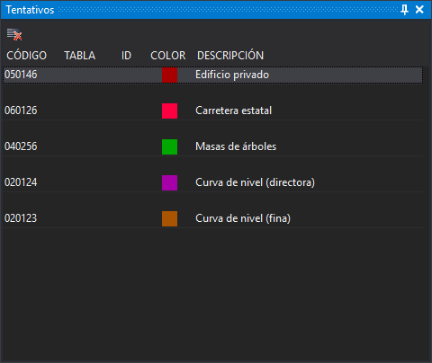

# Tentativos
<!-- id: panel-tentativos -->

Este panel muestra el histórico de los códigos de las entidades que se han tentativado con el botón de tentativo del ratón. Cada entidad tentativada añade sus códigos al principio de la lista, separados de la entidad anterior por una fila vacía, así que la entidad más reciente aparece arriba. Si la entidad tiene varios códigos, aparecen todos.

Al hacer doble clic sobre un código, este pasa a ser el código activo de la ventana de dibujo.

## Columnas

* **Código**: nombre del código.
* **Tabla** e **Id**: tabla de la base de datos y número de registro asociados al código, si se trabaja con base de datos.
* **Color**: color del código en la tabla de códigos.
* **Descripción**: descripción del código en la tabla de códigos.

## Barra de herramientas

* **Limpiar**: vacía la lista. Solo está habilitado si hay una ventana de dibujo abierta y la lista tiene algún código.

## Mostrar el panel

Se puede mostrar el panel de las siguientes formas:

* Mediante la opción del menú **Ventana/Tentativos**.
* Pulsando Alt+Mayús+S.

## Véase también

* [Barra de mensajes al tentativar y panel de tentativos](../../primeros-pasos/comenzando-a-utilizar-digi3d.ai/comenzando-con-la-ventana-de-dibujo/barra-mensajes-al-tentativar.md)
