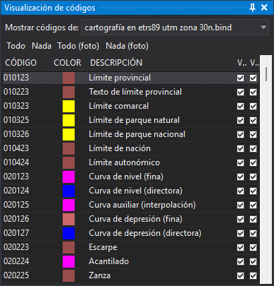

# Visualización de códigos
<!-- id: visualizacion-de-codigos -->

Este panel permite activar y desactivar la visualización de cada código, por separado en la ventana de dibujo y en la ventana fotogramétrica, para cada archivo de dibujo cargado.

## Barra de herramientas

* **Mostrar códigos de**: archivo de dibujo cuyos códigos se muestran. El desplegable contiene el archivo de dibujo principal y los archivos de referencia cargados.
* **Todo** y **Nada**: activan o desactivan la visualización de todos los códigos del archivo en la ventana de dibujo.
* **Todo (foto)** y **Nada (foto)**: activan o desactivan la visualización de todos los códigos del archivo en la ventana fotogramétrica.

## Columnas

* **Código**: nombre del código.
* **Color**: color del código en la tabla de códigos.
* **Descripción**: descripción del código en la tabla de códigos.
* Las dos últimas columnas tienen una casilla que activa o desactiva la visualización del código: la primera en la ventana de dibujo y la segunda en la ventana fotogramétrica.

## Códigos que aparecen

* Si el archivo de dibujo admite geometrías nuevas, aparecen todos los códigos de la tabla de códigos, de modo que se puede desactivar un código antes de que exista ninguna geometría con él.
* Si el archivo es de solo lectura o no puede almacenar geometrías, como una conexión con un servidor WMS, solo aparecen los códigos de sus geometrías. Una conexión WMS no tiene geometrías, así que su lista está vacía.

## Órdenes relacionadas

Las mismas operaciones se pueden realizar con las órdenes [OND](../ventana-de-dibujo/ordenes/o/ond.md), [OFFD](../ventana-de-dibujo/ordenes/o/offd.md), [ONS](../ventana-de-dibujo/ordenes/o/ons.md) y [OFFS](../ventana-de-dibujo/ordenes/o/offs.md).
