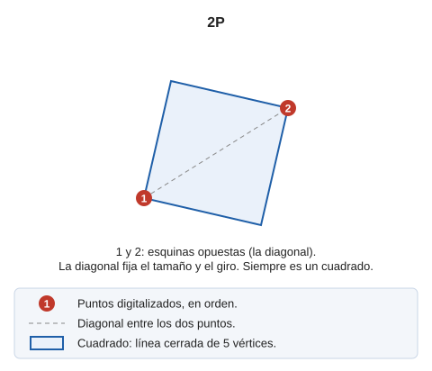

# 2P
<!-- id: 2p -->

Dibuja un cuadrado a partir de dos puntos.

## Parámetros

No admite parámetros.

## Observaciones

La orden solicita que se [introduzcan](../../introduccion-de-coordenadas.md) dos puntos, que son esquinas opuestas del cuadrado: la diagonal. Con ellos se calculan el tamaño y el giro del cuadrado.

El resultado final es un cuadrado formado por una línea cerrada de 5 puntos en la que el primer punto coincide con el último.

## Características de la orden

| Tipo de orden | [Orden interactiva](../../../ordenes/ordenes-interactivas.md) |
| :--- | :--- |
| Repite automáticamente | Si |
| Opción del menú donde aparece la orden | Dibujar/Más/Cuadrado con dos puntos |
| Barra de herramientas en la que aparece la orden | Cuadrados y rectángulos |
| Extensión | DigiNG.OrdenesStandard.dll |
| Variables relacionadas | [REPITE](/digi3d-ai/referencia/ventana-de-dibujo/variables/r/repite.md) — repite la última orden ejecutada |
| Órdenes relacionadas | [2P\_AA](/digi3d-ai/referencia/ventana-de-dibujo/ordenes/2/2p-aa.md) [3P](/digi3d-ai/referencia/ventana-de-dibujo/ordenes/3/3p.md) [RECTANGULO\_2P\_NORTE](/digi3d-ai/referencia/ventana-de-dibujo/ordenes/r/rectangulo-2p-norte.md) [RECTANGULO\_DR](/digi3d-ai/referencia/ventana-de-dibujo/ordenes/r/rectangulo-dr.md) |
| Nombre interno | {4F444510-6B05-4072-AFA2-D258FD9BA46D} |

## Vídeo

<video controls><source src="https://digi21.blob.core.windows.net/videos-ayuda/2P.mp4" caption="" type="video/mp4"></video>

