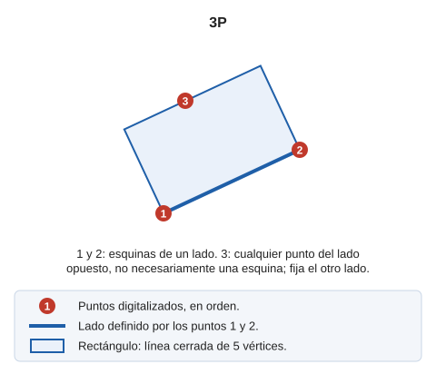

# 3P
<!-- id: 3p -->

Dibuja una forma geométrica rectangular.

## Parámetros

No admite parámetros.

## Observaciones

La orden requiere la entrada de 3 puntos, de forma que los dos primeros se corresponden con las esquinas de un lado, y el tercero con cualquier punto perteneciente al lado opuesto \(no es necesario que se corresponda con una esquina\).

Los puntos pueden definirse de forma gráfica o mediante la orden [XY](/digi3d-ai/referencia/ventana-de-dibujo/ordenes/x/xy.md).

El resultado final es un rectángulo definido por 5 puntos \(para que sea una entidad cerrada el primer punto y el último deben ser el mismo, por lo que se trata de una entidad de 5 puntos, 4 + 1\).

Al digitalizar los puntos el programa mostrará la distancia reducida, la diferencia de coordenadas en X e Y, y la distancia geométrica.

## Características de la orden

| Tipo de orden | [Orden interactiva](3p.md) |
| :--- | :--- |
| Repite automáticamente | Si |
| Opción del menú donde aparece la orden | Dibujar/Mas/Rectángulo con tres puntos |
| Barra de herramientas en la que aparece la orden | Cuadrados y rectángulos |
| Extensión | DigiNG.OrdenesStandard.dll |
| Variables relacionadas | [REPITE](/digi3d-ai/referencia/ventana-de-dibujo/variables/r/repite.md) — repite la última orden ejecutada |
| Órdenes relacionadas | [2P](/digi3d-ai/referencia/ventana-de-dibujo/ordenes/2/2p.md) [2P\_AA](/digi3d-ai/referencia/ventana-de-dibujo/ordenes/2/2p-aa.md) [RECTANGULO\_2P\_NORTE](/digi3d-ai/referencia/ventana-de-dibujo/ordenes/r/rectangulo-2p-norte.md) [RECTANGULO\_DR](/digi3d-ai/referencia/ventana-de-dibujo/ordenes/r/rectangulo-dr.md) |
| Nombre interno | {D7959DEC-5FFF-436a-A9CE-AB2A199ECE12} |

