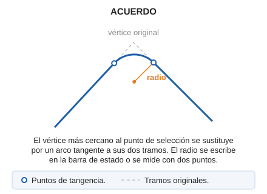

# ACUERDO

Dibuja un acuerdo circular entre dos segmentos con un vértice común de una entidad.

## Parámetros

No admite parámetros.

## Observaciones

1. Selecciona la línea junto al vértice que quieres redondear. La orden toma el vértice más cercano al punto de selección, que no puede ser el primero ni el último de la línea.
2. Indica el radio de una de estas dos formas:
   - escribe el radio en metros en el campo **Radio** de la barra de estado y pulsa Intro;
   - digitaliza dos puntos: el radio es la distancia en planta entre ellos.

El vértice se sustituye por un arco del radio indicado, tangente a los dos tramos que llegan a él. La Z de los puntos de tangencia se interpola en cada tramo.

Si el radio es tan grande que algún punto de tangencia cae fuera de su tramo, la orden muestra el mensaje **No se pudo realizar el acuerdo con los datos facilitados.** y no modifica la línea.

## Características de la orden

| Tipo de orden | [Orden interactiva](acuerdo.md) |
| :--- | :--- |
| Repite automáticamente | Si |
| Opción del menú donde aparece la orden | Editar/Polilíneas/Redondear un vértice |
| Barra de herramientas en la que aparece la orden | Editar polilínea |
| Extensión | DigiNG.OrdenesStandard.dll |
| Variables relacionadas | [REPITE](/digi3d-ai/referencia/ventana-de-dibujo/variables/r/repite.md) — repite la última orden ejecutada |
| Nombre interno | {63EDB2B3-4DC6-4584-9EFC-AAE939D3FFB3} |

