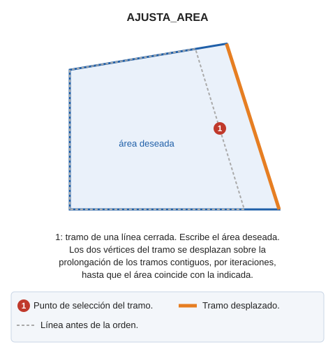

# AJUSTA\_AREA
<!-- id: ajusta-area -->

Mueve el segmento seleccionado para ajustar el área de la línea cerrada seleccionada al área deseada.

## Parámetros

| Número de parámetro | Descripción | Opcional |
| :--- | :--- | :--- |
| 1 | Número máximo de iteraciones (por defecto 100) | Si |
| 2 | Sigma | Si |

Si el control de calidad descarta la entidad modificada, la entidad original se conserva sin cambios.

## Características de la orden

| Tipo de orden | [Orden interactiva](ajusta-area.md) |
| :--- | :--- |
| Repite automáticamente | No |
| Opción del menú donde aparece la orden | _Esta orden no tiene asociada ninguna opción de menú_ |
| Barra de herramientas en la que aparece la orden | _Esta orden no tiene asociado ningún botón en ninguna barra de herramientas_ |
| Extensión | DigiNG.OrdenesStandard.dll |
| Variables relacionadas | No tiene variables relacionadas |
| Órdenes relacionadas | No tiene órdenes relacionadas |
| Nombre interno | {03678D49-92C8-4F25-BC8A-6F386BD08F5B} |
