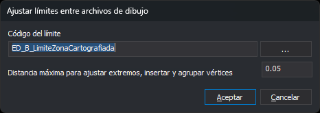

# AJUSTA\_LIMITES\_ARCHIVOS\_DIBUJO
<!-- id: ajusta-limites-archivos-dibujo -->

Ajusta las líneas de límite entre archivos de dibujo contiguos (cases): lleva a los límites los extremos libres cercanos de las líneas de cada archivo, inserta vértices en los límites donde llegan esas líneas y donde se acercan los límites del otro archivo, y agrupa los vértices cercanos de los límites moviendo con ellos los vértices de todas las geometrías que coinciden con ellos.

## Parámetros

| Número de parámetro | Descripción | Opcional |
| :--- | :--- | :--- |
| 1 | Código de las líneas que forman el límite entre archivos de dibujo. Admite los comodines `?` y `*` | No |
| 2 | Distancia máxima, en las unidades de las coordenadas del dibujo. Tiene que ser un número mayor que 0, con punto decimal | No |

Si indicas menos de dos parámetros, la orden no tiene en cuenta ninguno y muestra el cuadro de diálogo. Si el código está vacío, la orden emite el sonido de error, muestra _Indica el código de las líneas del límite_ y termina. Si la distancia no es un número mayor que 0, emite el sonido de error, muestra _La distancia tiene que ser un número mayor que 0_ y termina. En los dos casos no modifica nada.

## Observaciones

La orden necesita al menos dos archivos de dibujo cargados, contando el activo y los de referencia. Con menos, emite el sonido de error, muestra el mensaje _Se necesitan al menos dos archivos de dibujo para ajustar los límites_ y termina.

### Cuadro de diálogo

El cuadro _Ajustar límites entre archivos de dibujo_ tiene estos controles:

| Control | Descripción |
| :--- | :--- |
| Código del límite | Código de las líneas que forman el límite entre archivos, normalmente el marco de cada hoja. El botón **...** abre el cuadro de selección de códigos y copia en el campo el primer código elegido. Si cancelas ese cuadro, el campo conserva su valor |
| Distancia máxima para ajustar extremos, insertar y agrupar vértices | Distancia, en las unidades de las coordenadas del dibujo, que la orden usa en los tres pasos del ajuste. 0,05 por defecto |

Al pulsar _Aceptar_, el cuadro comprueba los datos. Si el código está vacío, muestra _Indica el código de las líneas del límite_. Si la distancia no es un número mayor que 0, escrito con punto decimal, muestra _La distancia tiene que ser un número mayor que 0_. En los dos casos el cuadro sigue abierto con el cursor en el campo.

Con los datos correctos, el cuadro guarda el código y la distancia en los valores `CodigoLimite` y `Distancia` de la clave del registro `HKEY_CURRENT_USER\Software\Digi21\Digi3D.NET\DigiNG\Extensiones\DigiNG.OrdenesTopololgia\DialogoAjustarLimitesArchivosDibujo`. La siguiente vez que ejecutes la orden, el cuadro muestra esos valores. Si ejecutas la orden con parámetros, no se guarda nada.

Si pulsas _Cancelar_, la orden termina sin modificar nada.

### Ajuste

La orden toma como líneas de límite las líneas no borradas que tienen el código del límite entre sus códigos. El código admite los comodines `?` \(un carácter cualquiera\) y `*` \(el resto del código\), no admite etiquetas `#` y distingue mayúsculas de minúsculas. Los polígonos con ese código no son límites.

La orden procesa cada par de archivos de dibujo cargados, incluidos los de referencia. Con tres o más archivos, cada archivo se procesa una vez por cada uno de los demás. En cada par:

1. **Ajuste de extremos.** En cada uno de los dos archivos, por separado:
   * Borra las líneas de dos vértices con un extremo libre y una longitud en planta menor que la distancia. Esto afecta a todas las líneas visibles del archivo, estén o no cerca de un límite.
   * Mueve a la línea de límite de ese mismo archivo cada extremo libre de una línea visible que quede del límite a una distancia no mayor que la indicada, medida por separado en X y en Y. Si hay un vértice del límite dentro de esa distancia, el extremo pasa a ese vértice; si no, pasa al pie de la perpendicular sobre el segmento. Un extremo libre es el que no comparte posición con el extremo de otra línea. La orden cambia la X y la Y del extremo y conserva su Z.
2. **Vértices de las líneas que llegan al límite.** En cada uno de los dos archivos, inserta en la línea de límite un vértice en cada punto en que una línea visible del mismo archivo la toca o la cruza. Solo modifica las líneas de límite. La Z del vértice nuevo se interpola en el segmento del límite.
3. **Vértices entre límites.** Con las líneas de límite de los dos archivos, inserta un vértice en un límite donde otro límite lo cruza o donde un vértice de otro límite queda a menos de la distancia de uno de sus segmentos. El vértice nuevo toma la X y la Y de ese vértice, y la Z interpolada en el segmento.
4. **Agrupación de vértices.** Con los vértices de las líneas de límite de los dos archivos, junta cada grupo de vértices que están a menos de la distancia en planta y calcula la posición media del grupo. Después recorre todas las geometrías no borradas de los dos archivos, de cualquier código y tipo, visibles u ocultas, y mueve a esa posición media cada vértice que coincide con uno de los vértices agrupados. La orden solo cambia la X y la Y de esos vértices.

Los pasos 1 a 3 solo tienen en cuenta las líneas visibles: no analizan las líneas de los códigos apagados ni las que están fuera de la zona de interés.

Dos puntos coinciden si la diferencia en X y en Y es menor que el valor _Sigma_ de la pestaña [Archivo de dibujo](/digi3d-ai/referencia/cuadros-de-dialogo/nuevo-proyecto/archivo-de-dibujo.md) del proyecto \(0,001 por defecto\).

Tras el paso 2, cada línea que llega al límite de su archivo termina en un vértice del límite. Por eso, si ejecutas la orden antes de [DETECTAR\_ERRORES\_CONTINUIDAD\_LINEAS\_CASES](/digi3d-ai/referencia/ventana-de-dibujo/ordenes/d/detectar-errores-continuidad-lineas-cases.md), esa orden analiza todas las líneas que llegan al límite.

Cada geometría modificada se sustituye por una copia: la orden borra la original y añade la copia al mismo archivo. Para escribir en un archivo de referencia, la orden lo convierte temporalmente en el archivo activo, sin mostrar el aviso de cambio de archivo, y al terminar deja activo el archivo que lo era al empezar.

La orden no muestra ningún mensaje al terminar, tampoco si no encuentra líneas con el código del límite. Todos los cambios forman una sola operación: _Deshacer_ los revierte de una vez.

Si Digi3D.AI descarta alguna de las entidades nuevas, no se aplica la parte del ajuste a la que pertenece y se conservan las entidades originales de esa parte. El resto del ajuste se aplica con normalidad.

## Características de la orden

| Tipo de orden | Orden inmediata |
| :--- | :--- |
| Repite automáticamente | No |
| Opción del menú donde aparece la orden | Análisis geométricos/Ajustar límites entre archivos de dibujo... |
| Barra de herramientas en la que aparece la orden | _Esta orden no tiene asociado ningún botón en ninguna barra de herramientas_ |
| Extensión | DigiNG.OrdenesTopologia.dll |
| Variables relacionadas | No tiene variables relacionadas |
| Órdenes relacionadas | [CONTROL\_TOPOLOGICO\_CASES](/digi3d-ai/referencia/ventana-de-dibujo/ordenes/c/control-topologico-cases.md) [DETECTAR\_ERRORES\_ATRIBUTOS\_BBDD\_CASES](/digi3d-ai/referencia/ventana-de-dibujo/ordenes/d/detectar-errores-atributos-bbdd-cases.md) [DETECTAR\_ERRORES\_CONTINUIDAD\_LINEAS\_CASES](/digi3d-ai/referencia/ventana-de-dibujo/ordenes/d/detectar-errores-continuidad-lineas-cases.md) |
| Nombre interno | {F42F2BF5-3153-48EB-A78F-B59921A4E5EC} |
