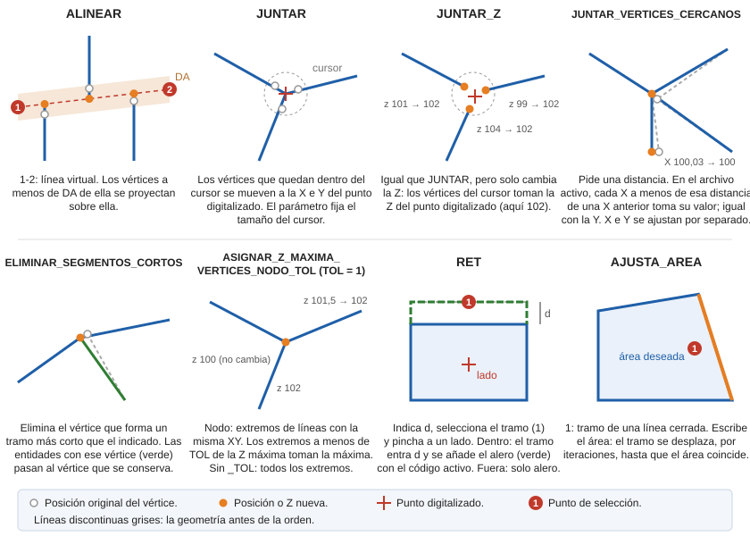

# ALINEAR

Mueve los vértices cuya distancia a la línea virtual digitalizada sea inferior o igual al valor de la [distancia activa principal](/digi3d-ai/referencia/ventana-de-dibujo/variables/d/da.md).

## Parámetros

No admite parámetros.

## Observaciones

Esta orden se utiliza para alinear segmentos de líneas. El usuario digitaliza una línea virtual formada por dos puntos y se localizan todos los vértices cuya distancia a la línea sea inferior a la _distancia activa principal._ Modifica la posición de todos esos vértices y los proyecta contra esa línea virtual.

## Características de la orden

| Tipo de orden | [Orden interactiva](alinear.md) |
| :--- | :--- |
| Repite automáticamente | Si |
| Opción del menú donde aparece la orden | Editar/Polilíneas/Alinear los vértices de líneas \(2 puntos\) |
| Barra de herramientas en la que aparece la orden | _Esta orden no tiene asignada ninguna barra de herramientas_ |
| Extensión | DigiNG.OrdenesStandard.dll |
| Variables relacionadas | [DA](/digi3d-ai/referencia/ventana-de-dibujo/variables/d/da.md) — distancia activa [REPITE](/digi3d-ai/referencia/ventana-de-dibujo/variables/r/repite.md) — repite la última orden ejecutada |
| Nombre interno | {DA40261D-4120-4d7b-8D1E-B8EC7423D95D} |

