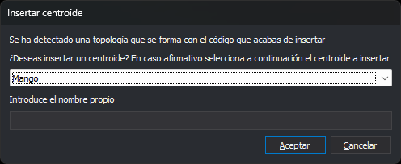

# ANADE\_CODIGOS\_ACTIVOS\_Y\_CENTROIDE
<!-- id: anade-codigos-activos-y-centroide -->

Añade los códigos activos a las líneas del contorno de los recintos seleccionados de la topología para inundaciones y, si existe una topología de la tabla de códigos formada por el código activo, inserta un centroide en el recinto.

## Parámetros

No admite parámetros.

## Observaciones

Esta es una orden de inundación: actúa sobre los recintos en los que haces clic, y necesita una topología para inundación cargada en memoria. Antes de ejecutarla, genera esa topología con [GENERAR\_TOPOLOGIA\_INUNDACION](/digi3d-ai/referencia/ventana-de-dibujo/ordenes/g/generar-topologia-inundacion.md) o [GENERAR\_TOPOLOGIA\_INUNDACION\_SIN\_ISLAS](/digi3d-ai/referencia/ventana-de-dibujo/ordenes/g/generar-topologia-inundacion-sin-islas.md), y vuelve a generarla si has modificado las líneas del dibujo. Si no hay topología para inundación, la orden muestra el aviso «No hay ninguna topología temporal creada», emite el sonido de error y termina, y la opción del menú **Inundación/Añadir códigos activos y centroide...** está deshabilitada. Esa opción también está deshabilitada si el primer código activo no es el único código de alguna topología de la tabla de códigos que tenga centroides definidos.

### Selección de recintos

La orden muestra el mensaje «Selecciona el área a la que añadir los códigos activos» y resalta el recinto que está bajo el cursor.

* Pulsa el botón de datos dentro de un recinto para seleccionarlo. La selección anterior se descarta.
* Mantén pulsada la tecla Ctrl al pulsar el botón de datos para añadir el recinto a la selección o quitarlo de ella.
* Pulsa el botón de tentativo para sustituir el último recinto seleccionado por el siguiente recinto que contiene el punto y que no está ya seleccionado. Si no hay ninguno, el último recinto sale de la selección y la orden emite el sonido de error.
* Pulsa el botón de reset para vaciar la selección.
* Pulsa la barra espaciadora para aceptar la selección. Si no hay ningún recinto seleccionado, la orden emite el sonido de error.
* Pulsa Esc para terminar la orden.

Tras aceptar una selección, la orden sigue activa para seleccionar más recintos.

### Códigos activos

Al aceptar la selección, la orden procesa las líneas del contorno exterior y de los huecos de los recintos seleccionados. Una línea que comparten dos recintos seleccionados no se procesa, porque queda dentro de la zona seleccionada.

A cada línea le añade al final los códigos activos que no tenga. Si está activada la opción que permite códigos repetidos, se los añade aunque ya los tenga. Una línea que no recibe ningún código no se modifica. Cada línea modificada se sustituye por una línea nueva con los mismos vértices, y la topología para inundaciones y las topologías cargadas del archivo de dibujo activo pasan a usar la línea nueva.

### Cuadro de diálogo

Después de añadir los códigos, si hay un único código activo, la orden busca en la tabla de códigos las [topologías](/digi3d-ai/referencia/editor-de-tablas-de-codigos/pestanas/topologias/README.md) cuyo único código es el código activo y que tienen [centroides](/digi3d-ai/referencia/editor-de-tablas-de-codigos/pestanas/topologias/centroide.md) definidos. Por cada una muestra el cuadro _Insertar centroide_. Si hay varios códigos activos, la orden no muestra el cuadro.

El desplegable contiene, en orden alfabético, los centroides de la topología. Cada centroide aparece con su descripción o, si no la tiene, con su texto. Al abrir el cuadro está seleccionado el primero.

_Introduce el nombre propio_ solo está habilitado si el centroide seleccionado es [variable](/digi3d-ai/referencia/editor-de-tablas-de-codigos/pestanas/topologias/anadir-centroide.md#variable), por ejemplo para escribir nombres de calles.

Al pulsar _Aceptar_, la orden inserta un texto en un punto interior del primer recinto seleccionado:

* El contenido es el texto del centroide. Si el centroide es variable, el texto del centroide va seguido, sin separación, del nombre propio que hayas escrito.
* Tiene la [altura de textos](/digi3d-ai/referencia/ventana-de-dibujo/variables/a/at.md), la [justificación de textos](/digi3d-ai/referencia/ventana-de-dibujo/variables/j/jt.md) y el [ángulo activo](/digi3d-ai/referencia/ventana-de-dibujo/variables/a/aa.md).
* Tiene los códigos activos y los atributos activos.

Si has seleccionado varios recintos, la orden inserta un solo texto, en el primero. El texto no se añade a la topología para inundaciones.

Si pulsas _Cancelar_, la orden no inserta el texto. Los códigos ya se han añadido a las líneas.

### Recintos procesados

Los recintos procesados quedan coloreados con el color de relleno del centroide elegido. Quedan en gris si el centroide no tiene color de relleno, si pulsas _Cancelar_ o si la orden no muestra el cuadro. Las marcas se mantienen al terminar la orden con Esc.

[UNDO](/digi3d-ai/referencia/ventana-de-dibujo/ordenes/u/undo.md) deshace de una vez los códigos añadidos y el texto insertado al aceptar una selección.

## Características de la orden

| Tipo de orden | [Orden interactiva](/digi3d-ai/referencia/ventana-de-dibujo/ordenes-interactivas.md) |
| :--- | :--- |
| Repite automáticamente | No. La orden sigue activa después de cada selección y termina con Esc |
| Opción del menú donde aparece la orden | Inundación/Añadir códigos activos y centroide... |
| Barra de herramientas en la que aparece la orden | _Esta orden no tiene asociado ningún botón en ninguna barra de herramientas_ |
| Extensión | DigiNG.OrdenesTopologia.dll |
| Variables relacionadas | [AA](/digi3d-ai/referencia/ventana-de-dibujo/variables/a/aa.md) — ángulo activo [AT](/digi3d-ai/referencia/ventana-de-dibujo/variables/a/at.md) — altura de los textos [JT](/digi3d-ai/referencia/ventana-de-dibujo/variables/j/jt.md) — justificación del texto |
| Órdenes relacionadas | [GENERAR\_TOPOLOGIA\_INUNDACION](/digi3d-ai/referencia/ventana-de-dibujo/ordenes/g/generar-topologia-inundacion.md) [GENERAR\_TOPOLOGIA\_INUNDACION\_SIN\_ISLAS](/digi3d-ai/referencia/ventana-de-dibujo/ordenes/g/generar-topologia-inundacion-sin-islas.md) [BORRA\_COD\_R](/digi3d-ai/referencia/ventana-de-dibujo/ordenes/b/borra-cod-r.md) [EDITAR\_CODIGOS\_R](/digi3d-ai/referencia/ventana-de-dibujo/ordenes/e/editar-codigos-r.md) [PONER\_ATR\_R](/digi3d-ai/referencia/ventana-de-dibujo/ordenes/p/poner-atr-r.md) [PONER\_COD\_RECINTO\_CENTROIDE](/digi3d-ai/referencia/ventana-de-dibujo/ordenes/p/poner-cod-recinto-centroide.md) [UNDO](/digi3d-ai/referencia/ventana-de-dibujo/ordenes/u/undo.md) |
| Nombre interno | {C37E57E7-6D28-401A-A862-3D96BABD2D0B} |
